<!-- SPDX-License-Identifier: CC-BY-4.0 -->

<p align="center"><a href="./README.md"></a> &nbsp; <a href="./README.zh.md"></a></p>

<h1 align="center">image2-workbench</h1>

<p align="center"><strong>Executable gpt-image-2 prompt templates for people who need repeatable images, not another prompt dump.</strong><br/>30 domains · 80 YAML templates · bilingual output · CLI / Skill / web ChatGPT paths.</p>

<p align="center"></p>

<p align="center">    </p>

<p align="center"><a href="#quick-start"><strong>Quick start</strong></a> · <a href="#showcase"><strong>Showcase</strong></a> · <a href="#atlas--30-domains-80-templates"><strong>Atlas</strong></a> · <a href="skills/gpt-image/"><strong>Skill bundle</strong></a></p>

## Quick start

```bash
git clone https://github.com/StartripAI/gpt-image-2.0-workbench.git
cd gpt-image-2.0-workbench
python -m venv .venv && source .venv/bin/activate
pip install -e ".[dev]"

i2w template render business_swot_card --lang en \
  --vars templates/business/_vars_examples/swot_acme.yml \
  --out out/swot.en.md
```

Open `out/swot.en.md`, paste the rendered prompt into web ChatGPT with image generation enabled, and edit the visible demo values. This path needs no API key.

## API path

```bash
export OPENAI_API_KEY=sk-...

i2w preflight out/swot.en.md --template-id business_swot_card
i2w cost compare --size 1024x1024,1536x1024 --quality low,medium,high
i2w render generate --prompt-file out/swot.en.md \
  --template-id business_swot_card \
  --size 1536x1024 --quality medium --out out/swot.png

# Optional local run history for API and batch workflows:
i2w ledger query --template business_swot_card
```

## What you get

| Need | Use |
|---|---|
| Copy-paste prompts | `i2w template render ... --out prompt.md`, then paste into web ChatGPT. |
| API generation | `i2w render generate` with local validation and sidecar metadata. |
| Cost control | `i2w cost compare`, `i2w cost estimate`, and `i2w batch sweep --dry-run`. |
| Request validation | `i2w preflight` rejects unsupported gpt-image-2 options before spend. |
| Local observability | `i2w ledger` summarizes render/preflight/batch history from JSONL. |
| Agent usage | Drop `skills/gpt-image/` into Codex, Claude Code, or another Skill runtime. |

The current extended atlas is **30 domains / 80 executable YAML templates**. The original V1 core remains `business`, `academic`, `uiux`, and `anime`; the expanded atlas adds product, ecommerce, advertising, social media, photography, fashion, food, architecture, interior, travel, and more.

<a id="showcase"></a>
## Showcase — 30 domains

Each image below is a rendered domain representative. Open a domain gallery to copy the bilingual prompt blocks, or open the template directory to customize the YAML source.

<p align="center"><strong>Browse by category:</strong> <a href="docs/gallery/business.md">business</a> · <a href="docs/gallery/academic.md">academic</a> · <a href="docs/gallery/uiux.md">uiux</a> · <a href="docs/gallery/anime.md">anime</a> · <a href="docs/gallery/ecommerce.md">ecommerce</a> · <a href="docs/gallery/product.md">product</a> · <a href="docs/gallery/advertising.md">advertising</a> · <a href="docs/gallery/social_media.md">social_media</a> · <a href="docs/gallery/gaming.md">gaming</a> · <a href="docs/gallery/photography.md">photography</a> · <a href="docs/gallery/fashion.md">fashion</a> · <a href="docs/gallery/food.md">food</a> · <a href="docs/gallery/architecture.md">architecture</a> · <a href="docs/gallery/interior.md">interior</a> · <a href="docs/gallery/industrial.md">industrial</a> · <a href="docs/gallery/infographic_data.md">infographic_data</a> · <a href="docs/gallery/travel.md">travel</a> · <a href="docs/gallery/typography.md">typography</a> · <a href="docs/gallery/beauty.md">beauty</a> · <a href="docs/gallery/events.md">events</a> · <a href="docs/gallery/tattoo.md">tattoo</a> · <a href="docs/gallery/watercolor_illustration.md">watercolor_illustration</a> · <a href="docs/gallery/isometric_illustration.md">isometric_illustration</a> · <a href="docs/gallery/comic_book.md">comic_book</a> · <a href="docs/gallery/music.md">music</a> · <a href="docs/gallery/science_fiction_concept.md">science_fiction_concept</a> · <a href="docs/gallery/kids_illustration.md">kids_illustration</a> · <a href="docs/gallery/automotive.md">automotive</a> · <a href="docs/gallery/pet.md">pet</a> · <a href="docs/gallery/streetwear.md">streetwear</a></p>

### business

<p align="center"><a href="docs/gallery/business.md"></a></p>

Boardroom-grade business artifacts: SWOT cards, pitch slides, analytics dashboards, and LinkedIn carousel covers. Use it when the image needs to look like something a team would actually ship into a deck or executive update. [Gallery](docs/gallery/business.md) · [Templates](templates/business/)

### academic

<p align="center"><a href="docs/gallery/academic.md"></a></p>

Scientific and education visuals with dense text discipline: chalkboard proofs, conference posters, multilingual teaching posters, and labeled diagrams. [Gallery](docs/gallery/academic.md) · [Templates](templates/academic/)

### uiux

<p align="center"><a href="docs/gallery/uiux.md"></a></p>

Product-design surfaces for believable app and web presentation: iOS mockups, web dashboards, design-system cards, and social tutorial covers. [Gallery](docs/gallery/uiux.md) · [Templates](templates/uiux/)

### anime

<p align="center"><a href="docs/gallery/anime.md"></a></p>

Anime-native image formats: character sheets, city posters, 8-panel comics, and CCD-style candid scenes. The prompts emphasize consistency, pose control, and readable in-image labels. [Gallery](docs/gallery/anime.md) · [Templates](templates/anime/)

### ecommerce

<p align="center"><a href="docs/gallery/ecommerce.md"></a></p>

Commerce layouts built for fast product understanding: marketplace cards, product hero shots, and category banners with headline and CTA space. [Gallery](docs/gallery/ecommerce.md) · [Templates](templates/ecommerce/)

### product

<p align="center"><a href="docs/gallery/product.md"></a></p>

Product communication plates for packaging, feature callouts, and side-by-side comparison boards. Good when the object and its selling points both need to stay legible. [Gallery](docs/gallery/product.md) · [Templates](templates/product/)

### advertising

<p align="center"><a href="docs/gallery/advertising.md"></a></p>

Campaign-facing images: key visuals, billboard mockups, and three-frame storyboards. The emphasis is on strong hierarchy, brand readability, and a clear commercial hook. [Gallery](docs/gallery/advertising.md) · [Templates](templates/advertising/)

### social_media

<p align="center"><a href="docs/gallery/social_media.md"></a></p>

Feed-native assets for launches, vertical story sequences, and thumbnail grids. These templates keep the message readable under small-screen scanning. [Gallery](docs/gallery/social_media.md) · [Templates](templates/social_media/)

### gaming

<p align="center"><a href="docs/gallery/gaming.md"></a></p>

Game UI and world-building plates: HUD mockups, collectible item cards, and quest-map panels. Use it for interfaces that need to feel playable rather than decorative. [Gallery](docs/gallery/gaming.md) · [Templates](templates/gaming/)

### photography

<p align="center"><a href="docs/gallery/photography.md"></a></p>

Photographic looks for editorial portraits, cinematic stills, and documentary scenes. Prompts focus on lens language, lighting, framing, and credible subject context. [Gallery](docs/gallery/photography.md) · [Templates](templates/photography/)

### fashion

<p align="center"><a href="docs/gallery/fashion.md"></a></p>

Fashion editorial formats: lookbook pages, flatlay boards, and runway posters. Built for outfit, material, and styling cues to survive the render. [Gallery](docs/gallery/fashion.md) · [Templates](templates/fashion/)

### food

<p align="center"><a href="docs/gallery/food.md"></a></p>

Food-service and packaged-food assets: menu posters, recipe cards, and labels. These templates reserve space for names, prices, ingredients, and brand marks. [Gallery](docs/gallery/food.md) · [Templates](templates/food/)

### architecture

<p align="center"><a href="docs/gallery/architecture.md"></a></p>

Architecture presentation imagery: facade concepts, site diagrams, and presentation boards. Useful for spatial ideas that need both atmosphere and diagram clarity. [Gallery](docs/gallery/architecture.md) · [Templates](templates/architecture/)

### interior

<p align="center"><a href="docs/gallery/interior.md"></a></p>

Interior design communication: room mockups, material boards, and before/after renovation edits. The templates protect layout zones for finishes, furniture, and labels. [Gallery](docs/gallery/interior.md) · [Templates](templates/interior/)

### industrial

<p align="center"><a href="docs/gallery/industrial.md"></a></p>

Industrial visuals for process explanation and safety communication: cutaways, flow diagrams, and factory-floor posters. [Gallery](docs/gallery/industrial.md) · [Templates](templates/industrial/)

### infographic_data

<p align="center"><a href="docs/gallery/infographic_data.md"></a></p>

Data-heavy editorial graphics: chart explainers and dashboard-style information panels. Good for keeping one quantitative story readable at a glance. [Gallery](docs/gallery/infographic_data.md) · [Templates](templates/infographic_data/)

### travel

<p align="center"><a href="docs/gallery/travel.md"></a></p>

Travel communication assets: destination posters, itinerary cards, and illustrated map guides. The prompts favor place identity, navigable layout, and clear trip information. [Gallery](docs/gallery/travel.md) · [Templates](templates/travel/)

### typography

<p align="center"><a href="docs/gallery/typography.md"></a></p>

Text-first image generation for lettering art and type specimen posters. Use it when the typography is the subject, not just a caption. [Gallery](docs/gallery/typography.md) · [Templates](templates/typography/)

### beauty

<p align="center"><a href="docs/gallery/beauty.md"></a></p>

Beauty and skincare visuals: packaging plates and editorial layouts with product callouts. The templates reserve room for small claims and premium material cues. [Gallery](docs/gallery/beauty.md) · [Templates](templates/beauty/)

### events

<p align="center"><a href="docs/gallery/events.md"></a></p>

Event-facing designs for concerts, festivals, and wedding invitations. Built around date, venue, lineup, and mood hierarchy. [Gallery](docs/gallery/events.md) · [Templates](templates/events/)

### tattoo

<p align="center"><a href="docs/gallery/tattoo.md"></a></p>

Tattoo design boards for flash sheets and minimal standalone designs. Prompts emphasize clean contours and reusable motif structure. [Gallery](docs/gallery/tattoo.md) · [Templates](templates/tattoo/)

### watercolor_illustration

<p align="center"><a href="docs/gallery/watercolor_illustration.md"></a></p>

Watercolor illustration formats for botanical studies and soft character portraits. The templates lean on paper texture, transparent washes, and restrained labels. [Gallery](docs/gallery/watercolor_illustration.md) · [Templates](templates/watercolor_illustration/)

### isometric_illustration

<p align="center"><a href="docs/gallery/isometric_illustration.md"></a></p>

Isometric scenes for city blocks and workspace layouts. Useful when you need structured spatial storytelling from a fixed projection. [Gallery](docs/gallery/isometric_illustration.md) · [Templates](templates/isometric_illustration/)

### comic_book

<p align="center"><a href="docs/gallery/comic_book.md"></a></p>

Comic-book surfaces: interior panel pages and variant covers. The prompts specify gutters, captions, speech balloon behavior, and cover hierarchy. [Gallery](docs/gallery/comic_book.md) · [Templates](templates/comic_book/)

### music

<p align="center"><a href="docs/gallery/music.md"></a></p>

Music visuals for album covers and concert posters. The templates balance artist identity, event metadata, and a strong central visual motif. [Gallery](docs/gallery/music.md) · [Templates](templates/music/)

### science_fiction_concept

<p align="center"><a href="docs/gallery/science_fiction_concept.md"></a></p>

Sci-fi concept images for cinematic keyframes and vehicle hero concepts. Use it for atmosphere, scale, and speculative design language. [Gallery](docs/gallery/science_fiction_concept.md) · [Templates](templates/science_fiction_concept/)

### kids_illustration

<p align="center"><a href="docs/gallery/kids_illustration.md"></a></p>

Children's illustration formats: storybook spreads and workbook pages. Prompts keep the scene friendly, readable, and structured around simple learning or story beats. [Gallery](docs/gallery/kids_illustration.md) · [Templates](templates/kids_illustration/)

### automotive

<p align="center"><a href="docs/gallery/automotive.md"></a></p>

Automotive marketing plates for hero ads and dealership posters. The templates reserve clean space for vehicle identity, pricing, or campaign copy. [Gallery](docs/gallery/automotive.md) · [Templates](templates/automotive/)

### pet

<p align="center"><a href="docs/gallery/pet.md"></a></p>

Pet-focused designs for adoption flyers and food packaging. The prompts keep the animal central while preserving contact details or packaging information. [Gallery](docs/gallery/pet.md) · [Templates](templates/pet/)

### streetwear

<p align="center"><a href="docs/gallery/streetwear.md"></a></p>

Streetwear launch imagery for drop lookbooks and sneaker hero plates. The templates emphasize silhouette, date, collection name, and retail energy. [Gallery](docs/gallery/streetwear.md) · [Templates](templates/streetwear/)

## Template Proof Set — 20 more renders

These are template-level examples generated in-session from the existing atlas. The 30 images above show domain coverage; the 20 images below show concrete template behaviors: dense UI, real placements, vertical posters, product boards, story sequences, and text-heavy layouts.

### business / data dashboard

<p align="center"><a href="docs/gallery/business.md">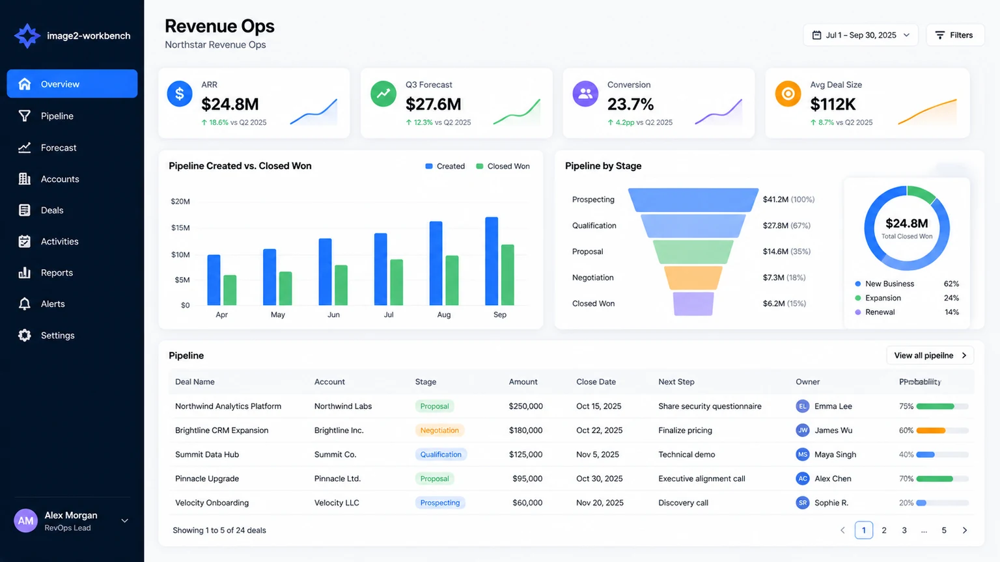</a></p>

Revenue operations dashboard with KPI cards, charts, pipeline rows, and an executive-ready layout. [Gallery](docs/gallery/business.md) · [Template](templates/business/data_dashboard.yml)

### business / pitch slide

<p align="center"><a href="docs/gallery/business.md">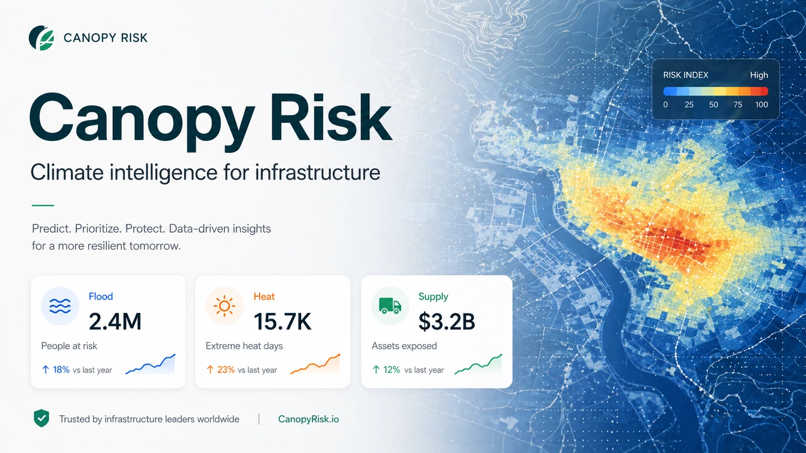</a></p>

Investor-style climate-risk title slide with a strong headline, metric cards, and a data-map visual. [Gallery](docs/gallery/business.md) · [Template](templates/business/pitch_slide.yml)

### academic / journal poster

<p align="center"><a href="docs/gallery/academic.md">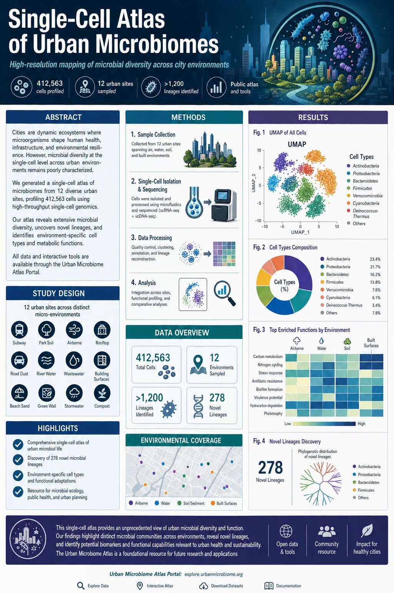</a></p>

Three-column scientific conference poster proving the atlas can handle dense academic hierarchy and figure blocks. [Gallery](docs/gallery/academic.md) · [Template](templates/academic/journal_poster.yml)

### academic / multilingual education poster

<p align="center"><a href="docs/gallery/academic.md">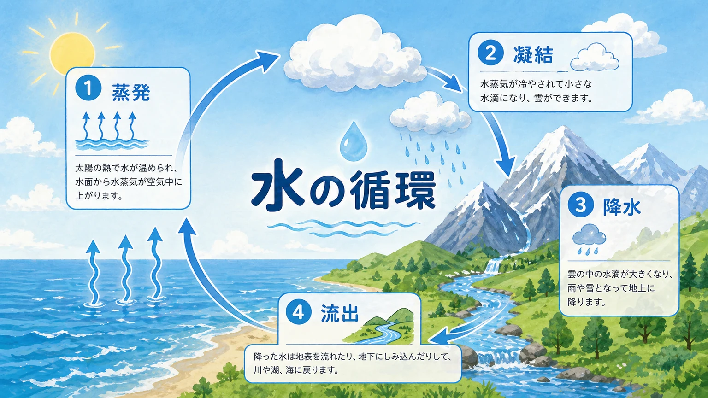</a></p>

Japanese classroom science poster with diagram arrows and labeled stages, useful for multilingual education assets. [Gallery](docs/gallery/academic.md) · [Template](templates/academic/multilingual_eduposter.yml)

### uiux / iOS app mockup

<p align="center"><a href="docs/gallery/uiux.md">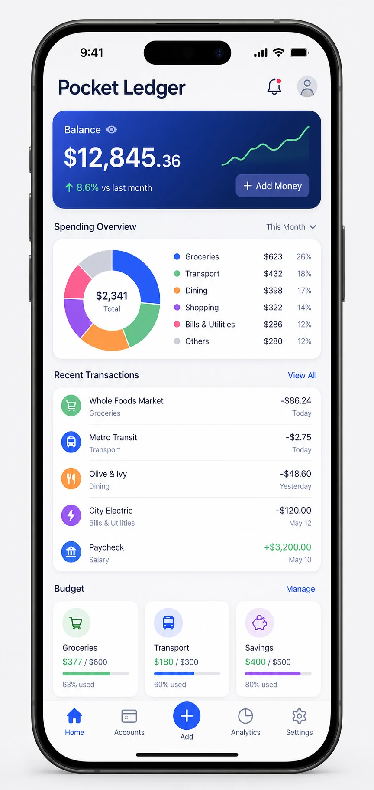</a></p>

Native-style personal finance app screen with balance cards, budget chart, and transaction list. [Gallery](docs/gallery/uiux.md) · [Template](templates/uiux/ios_app_mockup.yml)

### uiux / web dashboard

<p align="center"><a href="docs/gallery/uiux.md">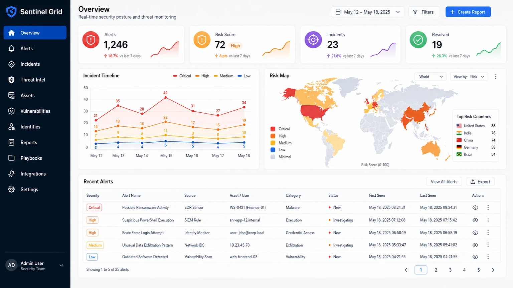</a></p>

Enterprise security dashboard with alerts, maps, incident metrics, and table density. [Gallery](docs/gallery/uiux.md) · [Template](templates/uiux/web_dashboard.yml)

### product / feature callout

<p align="center"><a href="docs/gallery/product.md">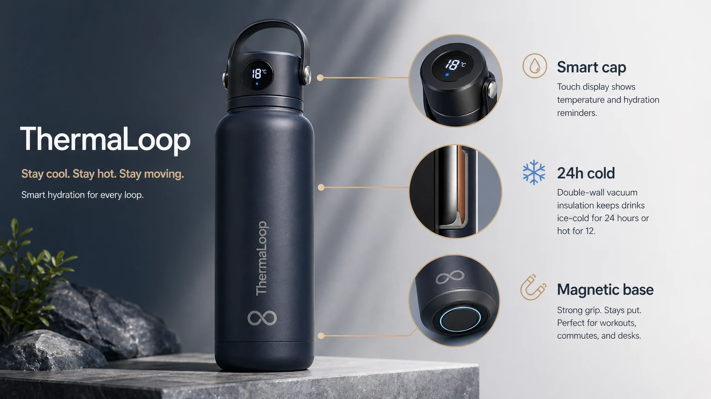</a></p>

Studio product plate with callouts for cap, insulation, and base features. [Gallery](docs/gallery/product.md) · [Template](templates/product/product_feature_callout.yml)

### product / comparison board

<p align="center"><a href="docs/gallery/product.md">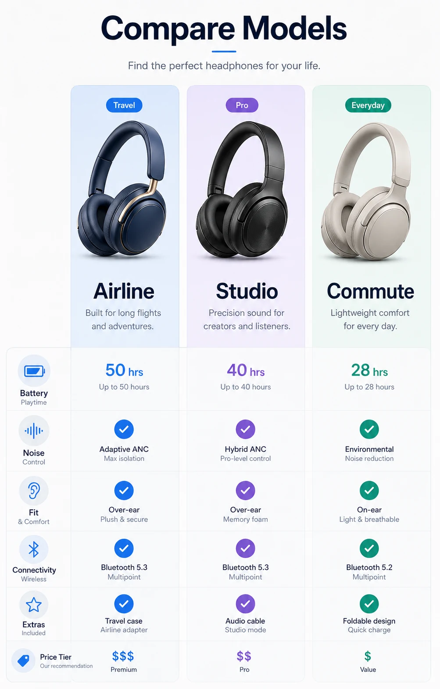</a></p>

Three-variant headphone comparison board with feature checks and pricing hierarchy. [Gallery](docs/gallery/product.md) · [Template](templates/product/product_comparison_board.yml)

### advertising / billboard mockup

<p align="center"><a href="docs/gallery/advertising.md">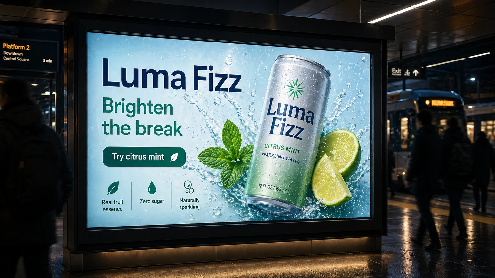</a></p>

Night transit-station placement mockup showing how a campaign key visual sits in a real environment. [Gallery](docs/gallery/advertising.md) · [Template](templates/advertising/advertising_billboard_mockup.yml)

### advertising / storyboard

<p align="center"><a href="docs/gallery/advertising.md">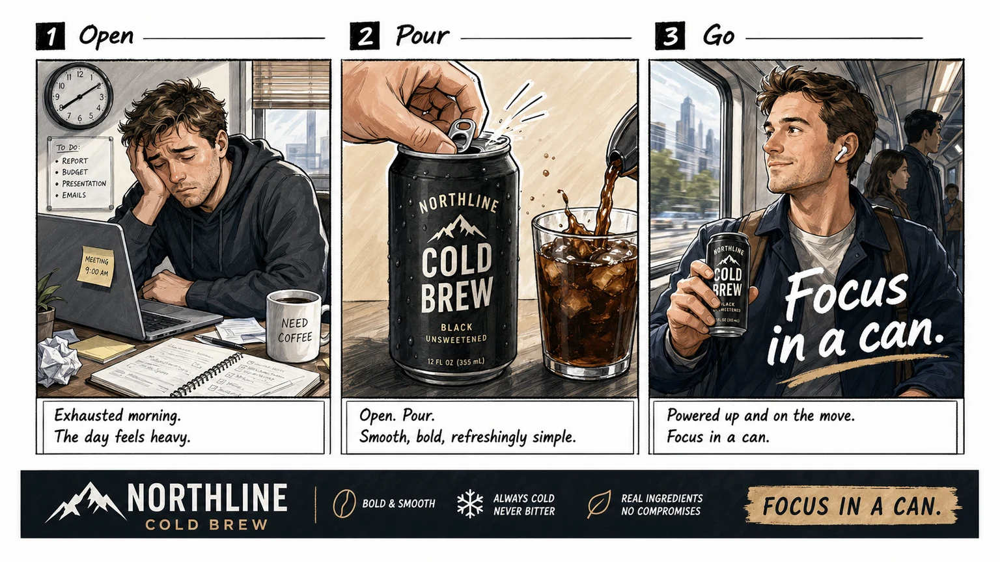</a></p>

Three-frame launch storyboard with scene continuity, captions, and a campaign strip. [Gallery](docs/gallery/advertising.md) · [Template](templates/advertising/advertising_storyboard_3frame.yml)

### ecommerce / product hero

<p align="center"><a href="docs/gallery/ecommerce.md">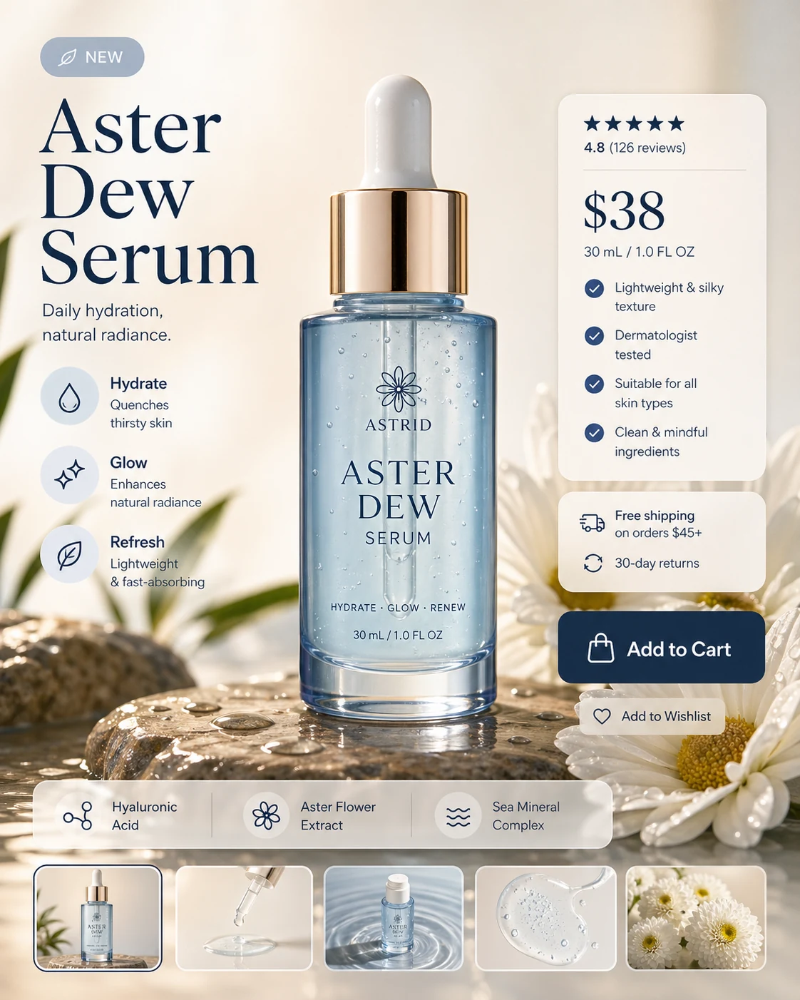</a></p>

Product-detail hero for a skincare serum with price, benefit chips, rating, and add-to-cart affordance. [Gallery](docs/gallery/ecommerce.md) · [Template](templates/ecommerce/ecommerce_product_hero.yml)

### ecommerce / category banner

<p align="center"><a href="docs/gallery/ecommerce.md">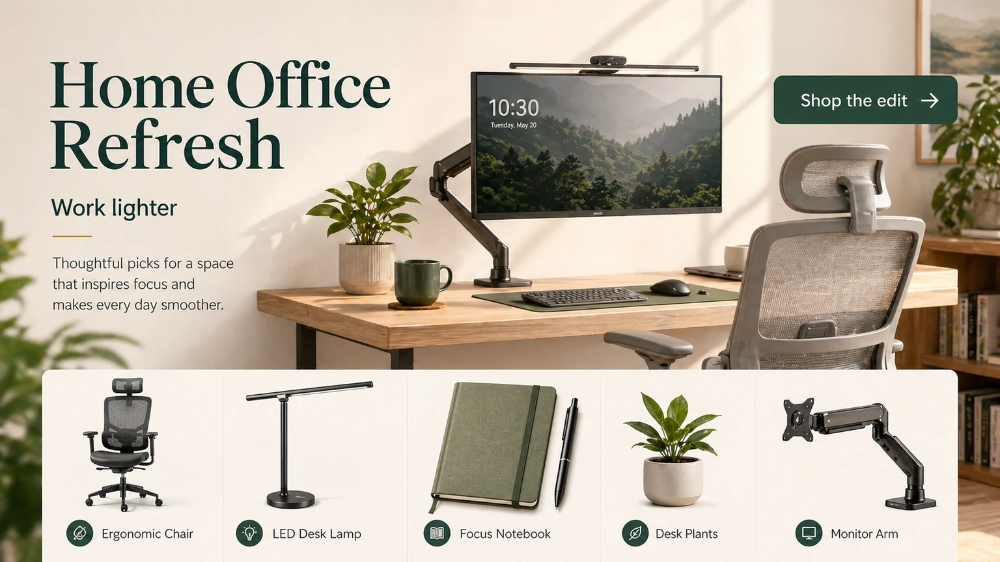</a></p>

Wide retail banner for a home-office collection, balancing product silhouettes, headline, and CTA. [Gallery](docs/gallery/ecommerce.md) · [Template](templates/ecommerce/ecommerce_category_banner.yml)

### social_media / story sequence

<p align="center"><a href="docs/gallery/social_media.md">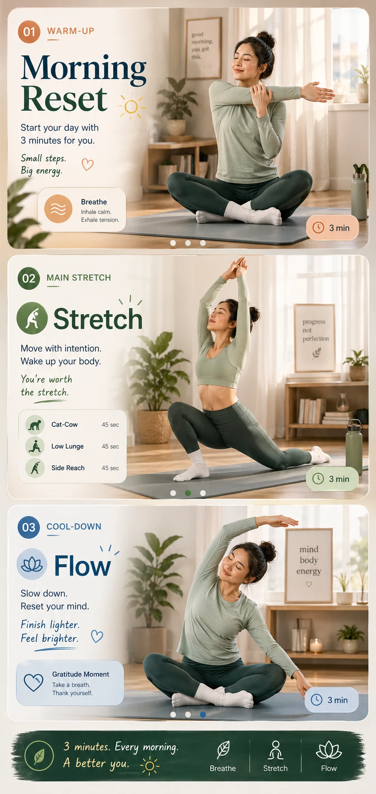</a></p>

Vertical three-card wellness story sequence with progress cues and creator-friendly captions. [Gallery](docs/gallery/social_media.md) · [Template](templates/social_media/social_media_story_sequence.yml)

### social_media / thumbnail grid

<p align="center"><a href="docs/gallery/social_media.md">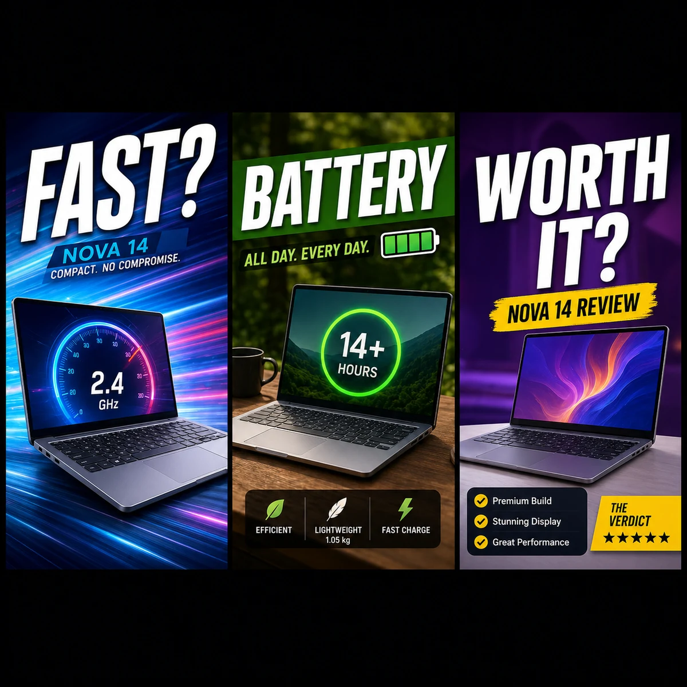</a></p>

Three thumbnail concepts for a tech-review video, demonstrating punchy small-screen composition. [Gallery](docs/gallery/social_media.md) · [Template](templates/social_media/social_media_thumbnail_grid.yml)

### gaming / HUD mockup

<p align="center"><a href="docs/gallery/gaming.md">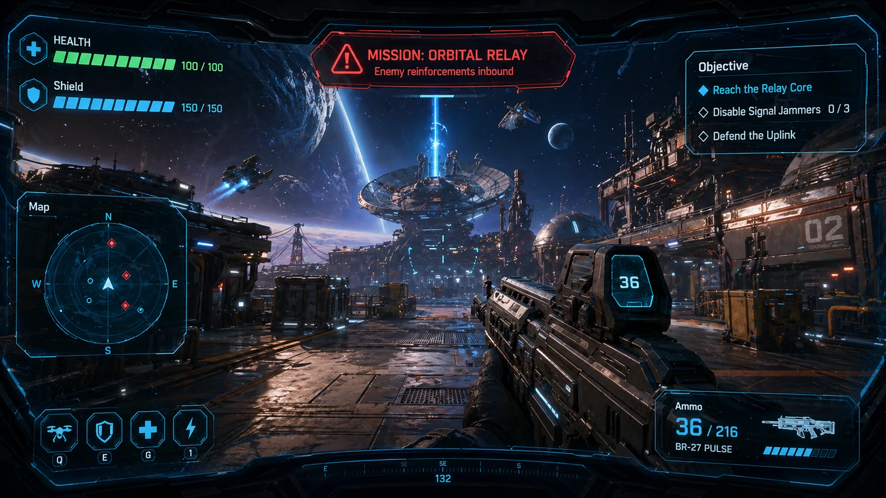</a></p>

Playable-feeling sci-fi HUD with objective, minimap, health, ammo, and edge-aligned interface layers. [Gallery](docs/gallery/gaming.md) · [Template](templates/gaming/gaming_hud_mockup.yml)

### gaming / item card

<p align="center"><a href="docs/gallery/gaming.md">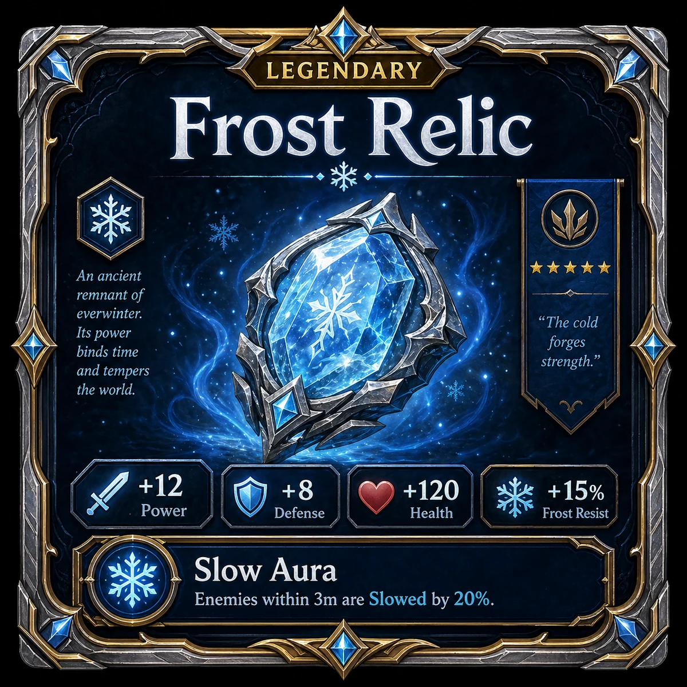</a></p>

Collectible item card with rarity ribbon, stats, icon, and readable fantasy UI hierarchy. [Gallery](docs/gallery/gaming.md) · [Template](templates/gaming/gaming_item_card.yml)

### interior / before-after

<p align="center"><a href="docs/gallery/interior.md">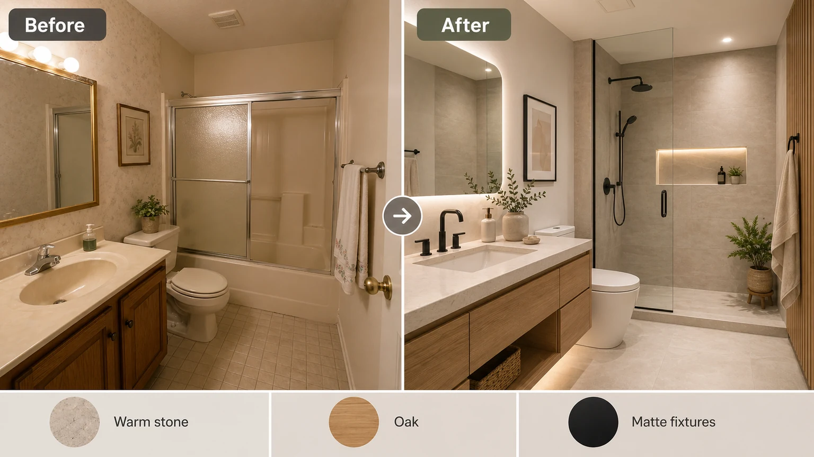</a></p>

Split-screen bathroom renovation board, useful for before/after edits and material communication. [Gallery](docs/gallery/interior.md) · [Template](templates/interior/interior_before_after.yml)

### architecture / presentation board

<p align="center"><a href="docs/gallery/architecture.md">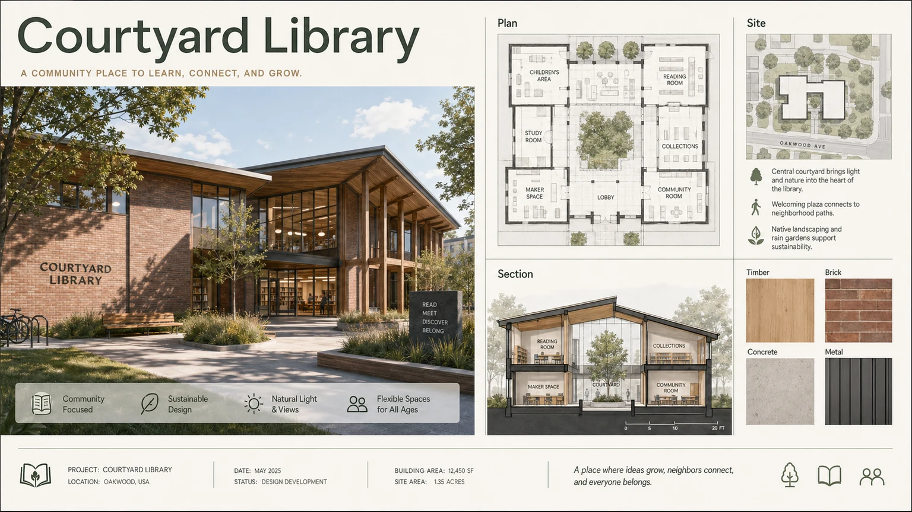</a></p>

Architecture board combining exterior render, plan, section, site diagram, and material swatches. [Gallery](docs/gallery/architecture.md) · [Template](templates/architecture/architecture_presentation_board.yml)

### photography / editorial portrait

<p align="center"><a href="docs/gallery/photography.md"></a></p>

Controlled editorial portrait showing the photography templates can produce believable human-centered imagery. [Gallery](docs/gallery/photography.md) · [Template](templates/photography/photography_editorial_portrait.yml)

### typography / specimen poster

<p align="center"><a href="docs/gallery/typography.md">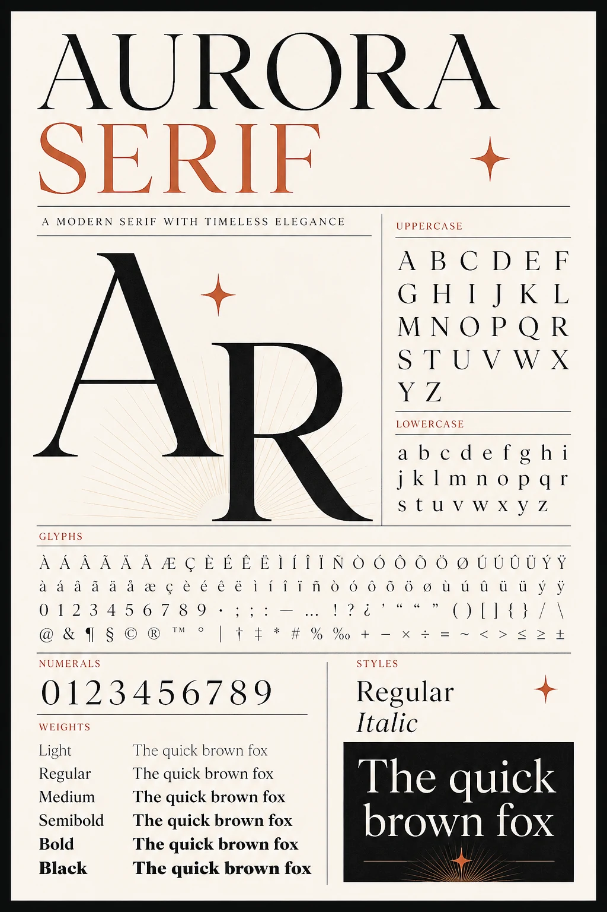</a></p>

Text-first specimen poster with glyph grid, numerals, weights, and a large display composition. [Gallery](docs/gallery/typography.md) · [Template](templates/typography/typography_specimen_poster.yml)

<!-- BEGIN GALLERY (auto-generated by `i2w gallery readme`; do not edit by hand) -->

<a id="atlas--30-domains-80-templates"></a>
## Atlas — 30 domains, 80 templates

The current extended atlas covers 30 domains. Each domain has a copy-ready bilingual gallery page, and the same YAML templates drive CLI, Skill, and API workflows.

| Domain | Templates | Good for | Representative templates | Open |
|---|---:|---|---|---|
| 🎓 `academic` | 4 | Photorealistic university chalkboard with a four-step mathematical proof and QED line. | `academic_chalkboard_proof` · `academic_journal_poster` | <a href="docs/gallery/academic.md">Gallery</a> · <a href="templates/academic/">Templates</a> |
| 📢 `advertising` | 3 | Photoreal urban billboard mockup with the hero ad pasted on a real-feeling outdoor placem… | `advertising_billboard_mockup` · `advertising_campaign_key_visual` | <a href="docs/gallery/advertising.md">Gallery</a> · <a href="templates/advertising/">Templates</a> |
| 🎌 `anime` | 4 | 复古 CCD 相机风格自拍 / Vintage CCD camera-style candid (a non-photoreal staged "authenticity"). | `anime_ccd_candid` · `anime_character_sheet` | <a href="docs/gallery/anime.md">Gallery</a> · <a href="templates/anime/">Templates</a> |
| 🏛️ `architecture` | 3 | Conceptual exterior facade rendering for an architecture studio's project poster. | `architecture_facade_concept` · `architecture_presentation_board` | <a href="docs/gallery/architecture.md">Gallery</a> · <a href="templates/architecture/">Templates</a> |
| 🚗 `automotive` | 2 | Point-of-sale dealership poster — vehicle hero plus price, financing terms, and dealer na… | `automotive_dealership_poster` · `automotive_hero_ad` | <a href="docs/gallery/automotive.md">Gallery</a> · <a href="templates/automotive/">Templates</a> |
| 💄 `beauty` | 2 | Magazine-style beauty editorial spread — close-up beauty shot with small product callouts. | `beauty_editorial_layout` · `beauty_skincare_packaging` | <a href="docs/gallery/beauty.md">Gallery</a> · <a href="templates/beauty/">Templates</a> |
| 📊 `business` | 4 | Light-theme analytics dashboard mockup with KPI tiles and two illustrative charts. | `business_data_dashboard` · `business_linkedin_carousel` | <a href="docs/gallery/business.md">Gallery</a> · <a href="templates/business/">Templates</a> |
| 💥 `comic_book` | 2 | Multi-panel American comic-book interior page with speech balloons, halftone shading, and… | `comic_book_panel_page` · `comic_book_variant_cover` | <a href="docs/gallery/comic_book.md">Gallery</a> · <a href="templates/comic_book/">Templates</a> |
| 🛍️ `ecommerce` | 3 | Wide 16:9 storefront category banner with a row of product silhouettes, headline, sub-tex… | `ecommerce_category_banner` · `ecommerce_marketplace_card` | <a href="docs/gallery/ecommerce.md">Gallery</a> · <a href="templates/ecommerce/">Templates</a> |
| 🎫 `events` | 2 | Vertical concert / festival poster with headliner, support, date, and venue. | `events_concert_poster` · `events_wedding_invite` | <a href="docs/gallery/events.md">Gallery</a> · <a href="templates/events/">Templates</a> |
| 👗 `fashion` | 3 | Styled flatlay of garments and accessories arranged on a surface for editorial use. | `fashion_flatlay_board` · `fashion_lookbook_page` | <a href="docs/gallery/fashion.md">Gallery</a> · <a href="templates/fashion/">Templates</a> |
| 🍽️ `food` | 3 | Vertical restaurant menu wall poster — categorized dish list with prices and accent. | `food_menu_poster` · `food_packaging_label` | <a href="docs/gallery/food.md">Gallery</a> · <a href="templates/food/">Templates</a> |
| 🎮 `gaming` | 3 | Fictional video-game HUD mockup with health and mana bars, minimap, mission objective ove… | `gaming_hud_mockup` · `gaming_item_card` | <a href="docs/gallery/gaming.md">Gallery</a> · <a href="templates/gaming/">Templates</a> |
| 🏭 `industrial` | 3 | Isometric cutaway / exploded view of an industrial machine with four labeled internal com… | `industrial_cutaway_view` · `industrial_process_diagram` | <a href="docs/gallery/industrial.md">Gallery</a> · <a href="templates/industrial/">Templates</a> |
| 📈 `infographic_data` | 2 | Single-chart explainer panel — large hero chart annotated with three pull-out callouts an… | `infographic_data_chart_explainer` · `infographic_data_dashboard` | <a href="docs/gallery/infographic_data.md">Gallery</a> · <a href="templates/infographic_data/">Templates</a> |
| 🛋️ `interior` | 3 | Split-screen interior before/after edit; left panel preserves the original, right panel s… | `interior_before_after` · `interior_material_board` | <a href="docs/gallery/interior.md">Gallery</a> · <a href="templates/interior/">Templates</a> |
| 🧊 `isometric_illustration` | 2 | True-isometric city block with named buildings, tiny vehicles, and street trees, projecte… | `isometric_city_block` · `isometric_workspace_scene` | <a href="docs/gallery/isometric_illustration.md">Gallery</a> · <a href="templates/isometric_illustration/">Templates</a> |
| 🧸 `kids_illustration` | 2 | Two-page children's storybook spread with friendly cast, narration band, and a single dia… | `kids_illustration_storybook_spread` · `kids_illustration_workbook_page` | <a href="docs/gallery/kids_illustration.md">Gallery</a> · <a href="templates/kids_illustration/">Templates</a> |
| 🎵 `music` | 2 | Square album-cover artwork — single hero visual identity with artist and album metadata. | `music_album_cover` · `music_concert_poster` | <a href="docs/gallery/music.md">Gallery</a> · <a href="templates/music/">Templates</a> |
| 🐾 `pet` | 2 | Single-animal adoption flyer — companion-animal photo with name, age, key trait, and shel… | `pet_adoption_flyer` · `pet_food_packaging` | <a href="docs/gallery/pet.md">Gallery</a> · <a href="templates/pet/">Templates</a> |
| 📷 `photography` | 3 | Film-frame still — anamorphic cinematic look capturing a single narrative beat. | `photography_cinematic_still` · `photography_documentary_scene` | <a href="docs/gallery/photography.md">Gallery</a> · <a href="templates/photography/">Templates</a> |
| 📦 `product` | 3 | Vertical 4:5 side-by-side comparison of three product variants with feature checkboxes by… | `product_comparison_board` · `product_feature_callout` | <a href="docs/gallery/product.md">Gallery</a> · <a href="templates/product/">Templates</a> |
| 🚀 `science_fiction_concept` | 2 | Cinematic sci-fi keyframe matte painting — alien landscape or far-future urban scene with… | `science_fiction_concept_keyframe` · `science_fiction_concept_vehicle_hero` | <a href="docs/gallery/science_fiction_concept.md">Gallery</a> · <a href="templates/science_fiction_concept/">Templates</a> |
| 🗯️ `social_media` | 3 | 1:1 feed-friendly Instagram or X launch announcement post for a new product, with date an… | `social_media_launch_post` · `social_media_story_sequence` | <a href="docs/gallery/social_media.md">Gallery</a> · <a href="templates/social_media/">Templates</a> |
| 👟 `streetwear` | 2 | Drop-announcement lookbook plate — single street look with drop date and collection name. | `streetwear_lookbook_drop` · `streetwear_sneaker_hero` | <a href="docs/gallery/streetwear.md">Gallery</a> · <a href="templates/streetwear/">Templates</a> |
| 🪡 `tattoo` | 2 | Traditional tattoo flash sheet — multiple design vignettes on aged paper. | `tattoo_flash_sheet` · `tattoo_minimal_design` | <a href="docs/gallery/tattoo.md">Gallery</a> · <a href="templates/tattoo/">Templates</a> |
| ✈️ `travel` | 3 | Vintage-style travel poster for a fictional or generic destination, with name, tagline, a… | `travel_destination_poster` · `travel_itinerary_card` | <a href="docs/gallery/travel.md">Gallery</a> · <a href="templates/travel/">Templates</a> |
| 🔤 `typography` | 2 | Hand-lettered art piece — a single phrase rendered as the visual subject. | `typography_lettering_art` · `typography_specimen_poster` | <a href="docs/gallery/typography.md">Gallery</a> · <a href="templates/typography/">Templates</a> |
| 📱 `uiux` | 4 | Square design-system showcase card highlighting a single component or token with prop row… | `uiux_design_system_card` · `uiux_ios_app_mockup` | <a href="docs/gallery/uiux.md">Gallery</a> · <a href="templates/uiux/">Templates</a> |
| 🎨 `watercolor_illustration` | 2 | Single-specimen botanical watercolor study with latin caption, in transparent washes on v… | `watercolor_botanical_study` · `watercolor_character_portrait` | <a href="docs/gallery/watercolor_illustration.md">Gallery</a> · <a href="templates/watercolor_illustration/">Templates</a> |

<p><strong>Read next:</strong> <a href="docs/getting-started.en.md">Getting started</a> · <a href="docs/chatgpt-web-mode.md">Web ChatGPT mode</a> · <a href="docs/cost-modeling.md">Cost modeling</a></p>

<!-- END GALLERY -->

## Workflow

<p align="center"></p>

One YAML template can drive three surfaces:

| Surface | When to use it | Entry point |
|---|---|---|
| Skill | You want an agent to select templates and run the workflow. | `skills/gpt-image/SKILL.md` |
| CLI / SDK | You want repeatable renders, validation, cost checks, batch payloads, and artifacts. | `i2w template`, `i2w render`, `i2w batch` |
| Prompt-only | You want a paste-ready prompt for web ChatGPT. | `docs/gallery/*.md` or `i2w template render` |

## CLI surface

`i2w --help` exposes 11 top-level commands:

| Group | Commands |
|---|---|
| Find and compose | `catalog`, `template`, `gallery` |
| Render and scale | `render`, `batch` |
| Budget and validate | `cost`, `preflight`, `doctor` |
| Inspect | `ledger`, `eval`, `version` |

Ledger stays local by default at `$IMAGE2_LEDGER_PATH` or `~/.image2/ledger.jsonl`; it is useful once you run API or batch jobs, but it is not required for prompt-only usage.

## Docs

- [Getting started](docs/getting-started.en.md)
- [Using image2-workbench in web ChatGPT](docs/chatgpt-web-mode.md)
- [Prompt craft](docs/prompt-craft.md)
- [Cost modeling](docs/cost-modeling.md)
- [Error codes](docs/error-codes.md)
- [Skill compatibility](docs/skill-compatibility.md)
- [Gallery index](docs/gallery/index.md)

## FAQ

**Do I need an API key?**
Not for the prompt-only path. `i2w template render` and the generated gallery pages produce markdown you can paste into web ChatGPT. `i2w render generate` and live Batch API submission need `OPENAI_API_KEY`.

**Why YAML instead of plain prompts?**
The template DSL keeps subject, action, scene, composition, style, text blocks, preserve rules, and negative constraints separate. That makes prompts easier to validate, translate, test, and reuse.

**Does this copy another prompt gallery?**
No. Templates, docs, and gallery pages in this repo are original to this workbench. External prompt collections can be useful references for structure, but do not copy their prompt text or README prose into this repo.

**Is `ledger` required?**
No. It is a local JSONL history for runs you execute through the CLI. It helps with cost rollups, top failures, and snapshot drift, but it is optional for people only browsing or pasting prompts.

## Project structure

```text
src/image2_workbench/     # CLI, runtime, compiler, catalog, costing, ledger
templates/                # 30 domains, 80 executable YAML templates
docs/gallery/             # generated bilingual prompt gallery pages
docs/assets/              # generated showcase images and README diagrams
skills/gpt-image/         # portable Skill bundle
tests/                    # unit, smoke, and golden-adjacent checks
```

## Licensing

Code is licensed under Apache-2.0. Templates, docs, README content, gallery pages, and showcased prompt text are licensed under CC BY 4.0. See [LICENSE](LICENSE), [LICENSE-CONTENT](LICENSE-CONTENT), [LICENSE-CC-BY-4.0](LICENSE-CC-BY-4.0), [NOTICE](NOTICE), and [docs/licensing.md](docs/licensing.md).

## Contributing

Read [AGENTS.md](AGENTS.md) before changing shared surfaces. Important repo rules include: do not pass `input_fidelity` to gpt-image-2, do not use `background: transparent`, do not default moderation to `low`, and keep new runtime dependencies out unless `pyproject.toml` and the PR explanation are updated together.
