<!-- SPDX-License-Identifier: CC-BY-4.0 -->

<p align="center"><a href="./README.md"></a> &nbsp; <a href="./README.zh.md"></a></p>

<h1 align="center">image2-workbench</h1>

<p align="center"><strong>A spec-first production workbench for OpenAI gpt-image-2.</strong><br/>80 executable templates &middot; 30 domains &middot; bilingual prompts &middot; cost / preflight / batch / ledger controls.</p>

<p align="center"></p>

<!-- Badges grouped into three rows so a narrow viewport doesn't crush them. -->

<p align="center"><sub><strong>STATUS</strong></sub></p>
<p align="center"></p>

<p align="center"><sub><strong>SCALE</strong></sub></p>
<p align="center"></p>

<p align="center"><sub><strong>STACK</strong></sub></p>
<p align="center"></p>

<p align="center"><a href="#-featured"><strong>✨ Featured →</strong></a> &nbsp;&middot;&nbsp; <a href="#atlas--30-domains-80-templates"><strong>🗂️ Atlas →</strong></a> &nbsp;&middot;&nbsp; <a href="#-quick-start"><strong>🚀 Quick start →</strong></a> &nbsp;&middot;&nbsp; <a href="./skills/gpt-image/"><strong>🤖 Skills →</strong></a> &nbsp;&middot;&nbsp; <a href="#-faq"><strong>❓ FAQ →</strong></a></p>

---

<a id="table-of-contents"></a>
## 📚 Table of contents

- [✨ Featured](#-featured)
- [🚀 Quick start](#-quick-start)
- [🗂️ Atlas — 30 domains, 80 templates](#atlas--30-domains-80-templates)
- [🖼️ Showcase](#-showcase)
- [🛠️ Capabilities](#-capabilities)
- [🔁 Workflow](#-workflow)
- [💻 CLI surface](#-cli-surface)
- [🤖 Skill ecosystem](#-skill-ecosystem)
- [❓ FAQ](#-faq)
- [🗂️ Project structure](#-project-structure)
- [📜 Licensing](#-licensing)
- [🙋 Contributing](#-contributing)

---

<a id="-at-a-glance"></a>
## ✨ At a glance

| Property | Value |
|---|---|
| Domains covered | **30** (business · academic · uiux · anime · ecommerce · industrial · product · advertising · social_media · gaming · photography · fashion · food · architecture · interior · travel · typography · beauty · events · tattoo · watercolor · isometric · comic_book · music · sci-fi · dataviz · kids · automotive · pet · streetwear) |
| Executable templates | **80** spec-first YAML files, all schema-validated, all bilingual |
| Showcase images | **30** rendered via gpt-image-2 (committed to `docs/assets/`) |
| CLI commands | **11** verbs (catalog · template · render · batch · cost · preflight · ledger · doctor · gallery · eval · version) |
| Skill runtimes | **7** (Claude Code · Codex · Anthropic API · LangChain · smolagents · OpenClaw · Hermes) |
| License | **Apache-2.0** (code) + **CC BY 4.0** (templates / docs) |
| Last updated | 2026-04-27 |

---

<a id="-why-a-workbench"></a>
## 🧰 Why a workbench?

Curated prompt lists are great for inspiration. They start to creak when you need <strong>reproducible outputs</strong> across templates, sizes, costs, and model snapshots — and a paper trail that survives a model snapshot change six months from now.

This repo turns prompt packs into auditable, executable, batchable workflows around three pillars:

<table cellpadding="14" cellspacing="0">
<tr>
<td width="33%" valign="top">
  <h3>💰 Cost predictability</h3>
  <p>Two-track cost model: official <code>(size, quality)</code> table + pixel-area heuristic + token-level estimator + Batch API <strong>50 % off</strong> path.</p>
  <p><sub><strong>CLI:</strong> <code>i2w cost compare</code> · <code>i2w cost estimate</code> · <code>i2w cost budget</code> · <code>i2w batch sweep</code></sub></p>
</td>
<td width="33%" valign="top">
  <h3>🛡️ Granular errors</h3>
  <p>Seven exit codes (<code>OK</code>, <code>AUTH</code>, <code>RATE_LIMIT</code>, <code>MODERATION_BLOCKED</code>, <code>VALIDATION</code>, <code>API_OTHER</code>, <code>INTERNAL</code>) plus local validation and pre-moderation.</p>
  <p><sub><strong>CLI:</strong> <code>i2w preflight</code> · <code>i2w doctor capabilities</code></sub></p>
</td>
<td width="33%" valign="top">
  <h3>📊 Observability</h3>
  <p>Append-only JSONL ledger; success rate, p50 / p95 latency, cost-per-output, snapshot drift, top failures.</p>
  <p><sub><strong>CLI:</strong> <code>i2w ledger query</code> · <code>i2w ledger top-failures</code> · <code>i2w ledger drift</code> · <code>i2w ledger export</code></sub></p>
</td>
</tr></table>

<p align="right"><sub><a href="docs/positioning.md">Full positioning thesis →</a></sub></p>

---

<a id="-featured"></a>
## ✨ Featured

<p align="center"><sub>The atlas at a glance — five hero compositions stitched from the 30-domain pool. Every image is rendered with gpt-image-2 against a spec yaml in this repo.</sub></p>

<p align="center"><a href="#atlas--30-domains-80-templates">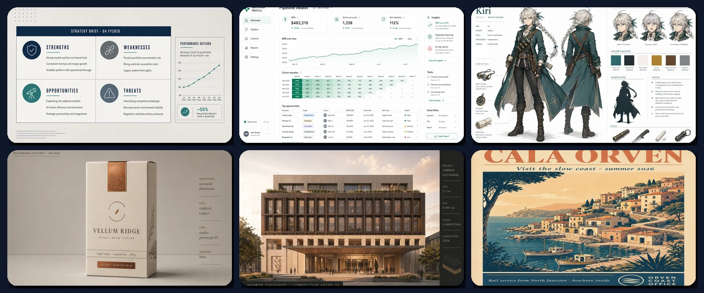</a></p>

<table cellpadding="10" cellspacing="0">
<tr>
<td width="50%" align="center" valign="top">
  <a href="#domain-business">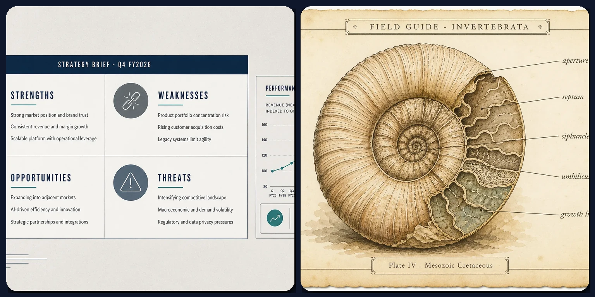</a><br/>
  <strong>📊 Business · 🎓 Academic</strong><br/>
  <sub>SWOT cards · pitch decks · scientific diagrams · journal posters</sub>
</td>
<td width="50%" align="center" valign="top">
  <a href="#domain-uiux">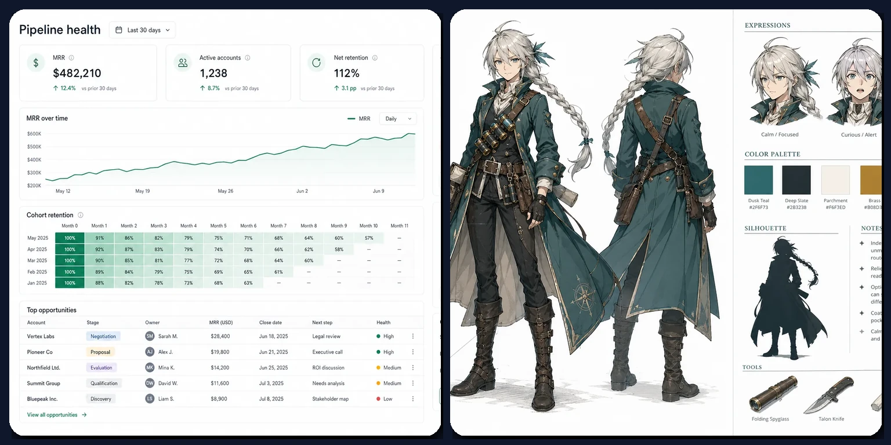</a><br/>
  <strong>📱 UI/UX · 🎌 Anime</strong><br/>
  <sub>iOS mockups · web dashboards · character sheets · 8-panel comics</sub>
</td>
</tr>
<tr>
<td width="50%" align="center" valign="top">
  <a href="#domain-fashion">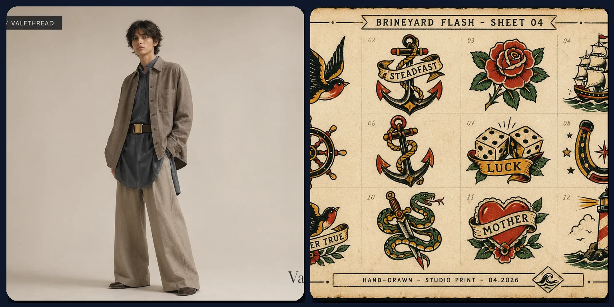</a><br/>
  <strong>👗 Fashion · 🪡 Tattoo</strong><br/>
  <sub>lookbooks · runway posters · flash sheets · minimal designs</sub>
</td>
<td width="50%" align="center" valign="top">
  <a href="#domain-architecture">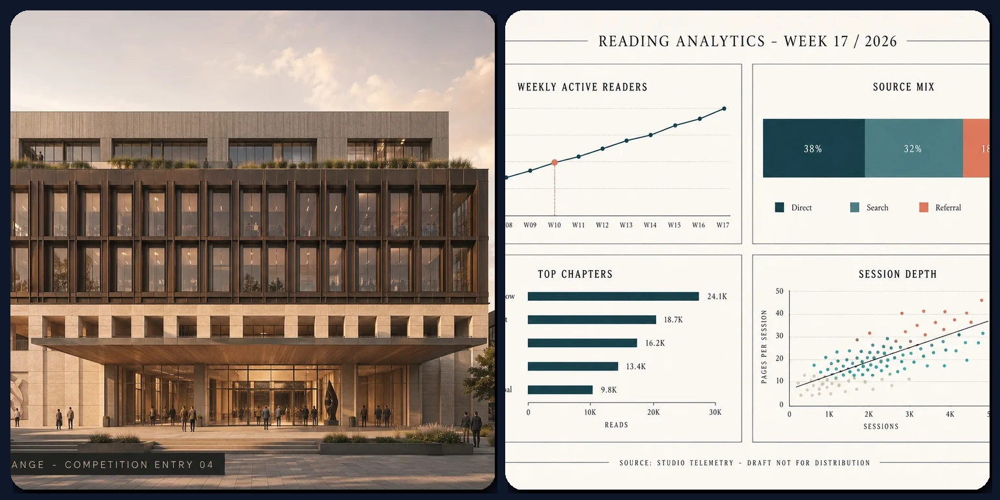</a><br/>
  <strong>🏛️ Architecture · 📈 Dataviz</strong><br/>
  <sub>facade studies · presentation boards · dashboards · chart explainers</sub>
</td>
</tr></table>

<p align="center"><sub>↓ scroll for the full <a href="#-showcase">30-domain showcase grid</a> · <a href="#atlas--30-domains-80-templates">browse the atlas</a></sub></p>

---

<a id="-quick-start"></a>
## 🚀 Quick start

<details open>
<summary><strong>Install (~30s)</strong></summary>

```bash
# After cloning your fork (or working from a local checkout):
git clone https://github.com/StartripAI/gpt-image-2.0-workbench.git
cd gpt-image-2.0-workbench

python -m venv .venv && source .venv/bin/activate
pip install -e ".[dev]"

i2w --help                  # 11 commands
i2w doctor capabilities     # probe parameter compatibility (no API key needed)
pytest -q                   # the workbench tests itself (1017+ passing)
```

</details>

<details>
<summary><strong>Render your first prompt (no API key required)</strong></summary>

```bash
i2w template render business_swot_card --lang en \
  --vars templates/business/_vars_examples/swot_acme.yml \
  --out out/swot.en.md
cat out/swot.en.md   # paste-ready into web ChatGPT
```

Then paste the markdown into ChatGPT's image dialog and download the image. This is the L3 path &mdash; web-only, no spend, no API key.

</details>

<details>
<summary><strong>Render through the API (requires <code>OPENAI_API_KEY</code>)</strong></summary>

```bash
export OPENAI_API_KEY=sk-...

# Catch broken requests locally before any spend:
i2w preflight out/swot.en.md --template-id business_swot_card

# Compare cost across (size, quality) before committing:
i2w cost compare --size 1024x1024,1536x1024 --quality low,medium,high

# Render and write a ledger row:
i2w render generate --prompt-file out/swot.en.md \
  --template-id business_swot_card \
  --size 1536x1024 --quality medium --out out/swot.png

# Inspect what just happened:
i2w ledger query --template business_swot_card
```

</details>

<details>
<summary><strong>Run a Batch API sweep (50% discount)</strong></summary>

```bash
i2w batch sweep \
  --template business_swot_card \
  --vars templates/business/_vars_examples/swot_acme.yml \
  --route batch-api \
  --dry-run                                # preview JSONL payload, no spend

i2w batch sweep ... --route batch-api      # submit when ready
```

</details>

<p><sub><a href="docs/getting-started.en.md">Longer walkthrough →</a> &nbsp;·&nbsp; <a href="docs/cost-modeling.md">Cost modeling →</a> &nbsp;·&nbsp; <a href="docs/error-codes.md">Error codes →</a></sub></p>

---

<!-- BEGIN GALLERY (auto-generated by `i2w gallery readme`; do not edit by hand) -->

<a id="atlas--30-domains-80-templates"></a>
## Atlas — 30 domains, 80 templates

<table cellpadding="12" cellspacing="0">
<tr>
<td width="33%" valign="top">

<a id="domain-academic"></a>
### 🎓 academic · 4 templates &nbsp; <a href="docs/assets/showcase-academic.webp">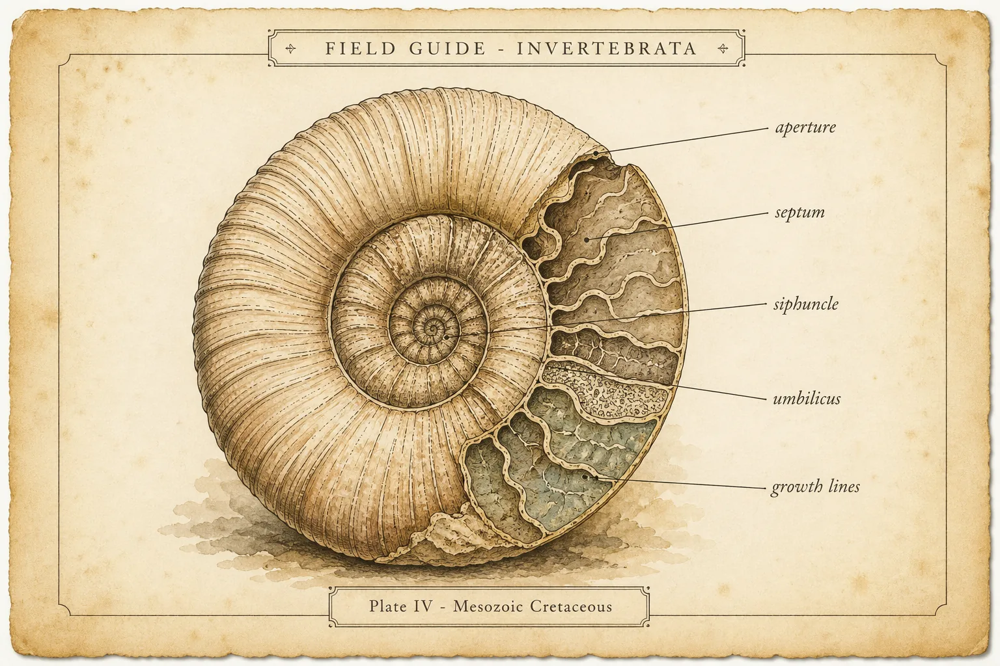</a>

| template | size | grader |
|---|---|---|
| <strong>academic_chalkboard_proof</strong><br/>Photorealistic university chalkboard with a four-step mathematical proof and QED line. | 1920x1088 | text_fidelity_dense |
| <strong>academic_journal_poster</strong><br/>Vertical 3-column conference poster with intro, methods, results, conclusion. | 1088x1920 | text_fidelity_dense |
| <strong>academic_multilingual_eduposter</strong><br/>Multilingual education infographic. Designed for Korean / Japanese / Chinese / Arabic / Hindi educational posters; the image's text is in language_na… | 1920x1088 | text_fidelity_dense |
| <strong>academic_scientific_diagram</strong><br/>Museum-style cross-section or labeled scientific illustration with five callouts. | 1536x1024 | text_fidelity_dense |

<sub><a href="templates/academic/"><strong>View 4 templates →</strong></a></sub>

</td>
<td width="33%" valign="top">

<a id="domain-advertising"></a>
### 📢 advertising · 3 templates &nbsp; <a href="docs/assets/showcase-advertising.webp">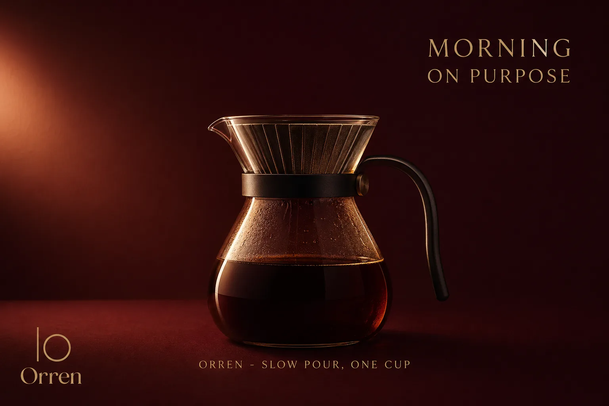</a>

| template | size | grader |
|---|---|---|
| <strong>advertising_billboard_mockup</strong><br/>Photoreal urban billboard mockup with the hero ad pasted on a real-feeling outdoor placement. | 1920x1088 | layout |
| <strong>advertising_campaign_key_visual</strong><br/>Premium production-grade brand campaign hero key-visual with tagline, product name, and call-to-action. | 1920x1088 | text_fidelity_dense |
| <strong>advertising_storyboard_3frame</strong><br/>Three-panel storyboard sketch for a 30-second commercial, with brand seal beneath the panels. | 1536x1024 | continuity |

<sub><a href="templates/advertising/"><strong>View 3 templates →</strong></a> &nbsp;·&nbsp; <a href="templates/advertising/DOMAIN_CARD.md">Domain card</a></sub>

</td>
<td width="33%" valign="top">

<a id="domain-anime"></a>
### 🎌 anime · 4 templates &nbsp; <a href="docs/assets/showcase-anime.webp">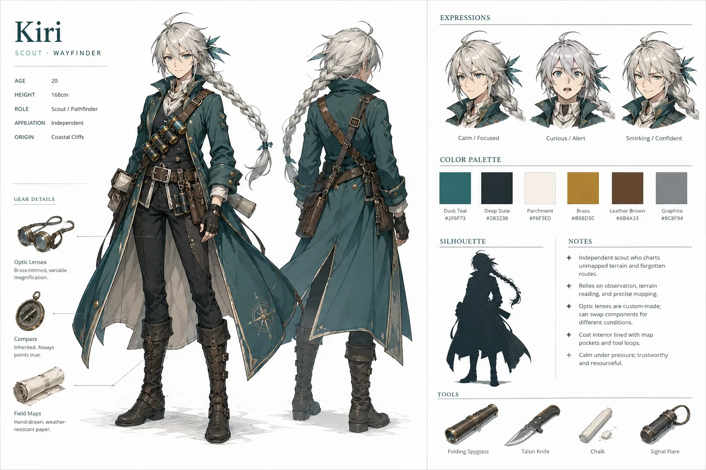</a>

| template | size | grader |
|---|---|---|
| <strong>anime_ccd_candid</strong><br/>复古 CCD 相机风格自拍 / Vintage CCD camera-style candid (a non-photoreal staged "authenticity"). | 1088x1920 | text_fidelity_sparse |
| <strong>anime_character_sheet</strong><br/>Concept-art character reference sheet with three-view turnaround, expression sheet, and prop detail. | 1920x1088 | continuity |
| <strong>anime_city_poster</strong><br/>双语城市旅行海报 / Bilingual editorial city travel poster mixing calligraphic skyline and premium typography. | 1088x1920 | text_fidelity_dense |
| <strong>anime_comic_8panel</strong><br/>Eight-panel sequential manga page rendered in black-and-white seinen ink with strict character continuity. | 1024x1536 | continuity |

<sub><a href="templates/anime/"><strong>View 4 templates →</strong></a></sub>

</td>
</tr>
<tr>
<td width="33%" valign="top">

<a id="domain-architecture"></a>
### 🏛️ architecture · 3 templates &nbsp; <a href="docs/assets/showcase-architecture.webp">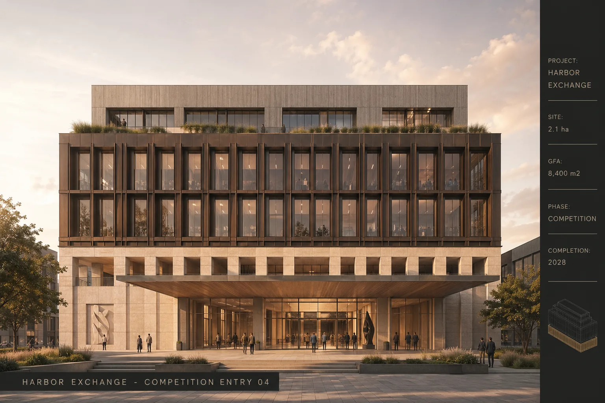</a>

| template | size | grader |
|---|---|---|
| <strong>architecture_facade_concept</strong><br/>Conceptual exterior facade rendering for an architecture studio's project poster. | 1536x1024 | text_fidelity_dense |
| <strong>architecture_presentation_board</strong><br/>Multi-panel architecture presentation board combining concept, diagram, render, and short text. | 1920x1088 | layout |
| <strong>architecture_site_diagram</strong><br/>Site plan / urban-context diagram with three labeled zones, drawn in plan view. | 1920x1088 | text_fidelity_dense |

<sub><a href="templates/architecture/"><strong>View 3 templates →</strong></a> &nbsp;·&nbsp; <a href="templates/architecture/DOMAIN_CARD.md">Domain card</a></sub>

</td>
<td width="33%" valign="top">

<a id="domain-automotive"></a>
### 🚗 automotive · 2 templates &nbsp; <a href="docs/assets/showcase-automotive.webp">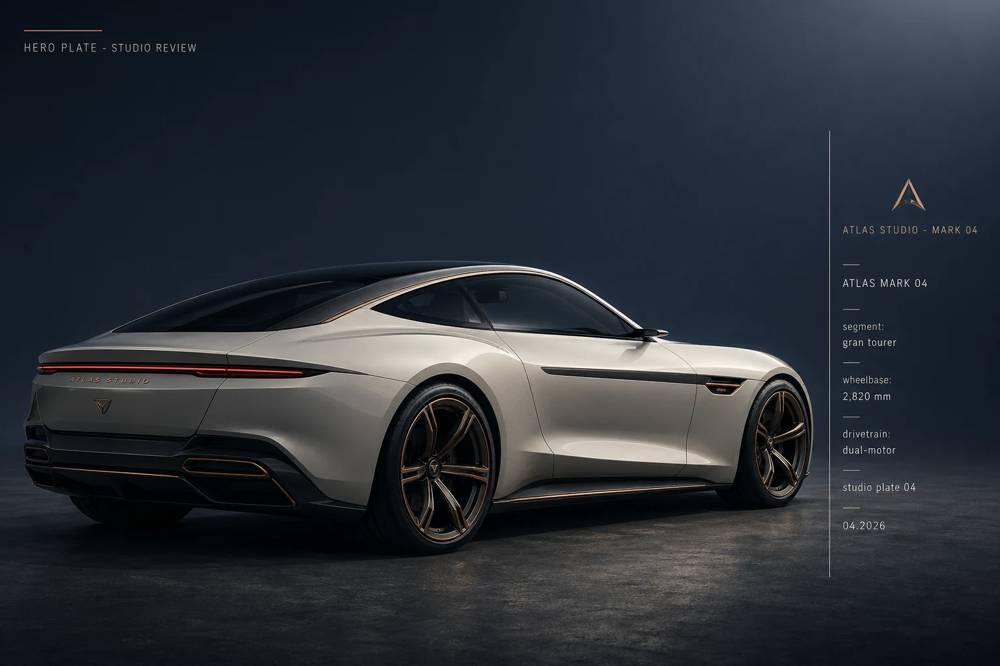</a>

| template | size | grader |
|---|---|---|
| <strong>automotive_dealership_poster</strong><br/>Point-of-sale dealership poster — vehicle hero plus price, financing terms, and dealer name. | 1024x1280 | text_fidelity_dense |
| <strong>automotive_hero_ad</strong><br/>Cinematic single-vehicle hero ad — fictional car, motorcycle, or EV on a deliberate backdrop. | 1920x1088 | text_fidelity_sparse |

<sub><a href="templates/automotive/"><strong>View 2 templates →</strong></a> &nbsp;·&nbsp; <a href="templates/automotive/DOMAIN_CARD.md">Domain card</a></sub>

</td>
<td width="33%" valign="top">

<a id="domain-beauty"></a>
### 💄 beauty · 2 templates &nbsp; <a href="docs/assets/showcase-beauty.webp">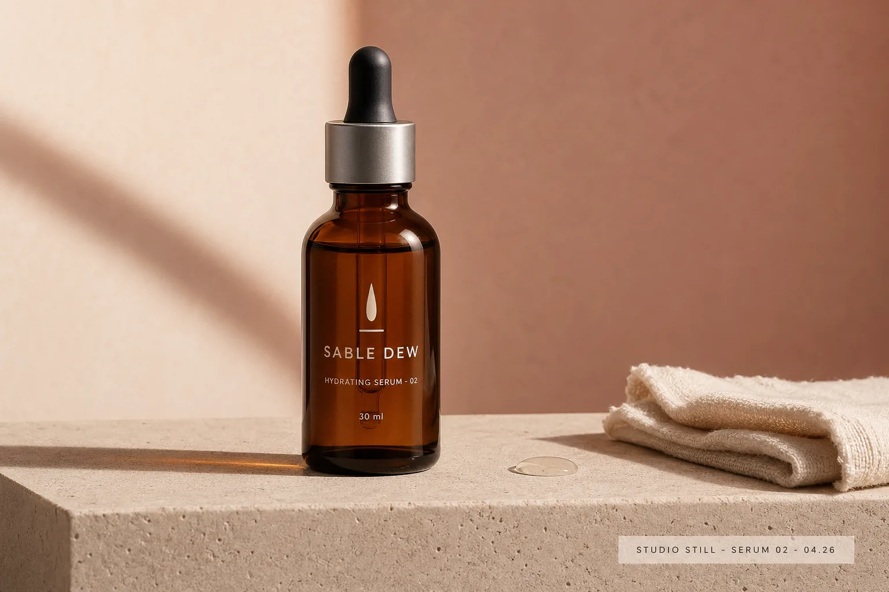</a>

| template | size | grader |
|---|---|---|
| <strong>beauty_editorial_layout</strong><br/>Magazine-style beauty editorial spread — close-up beauty shot with small product callouts. | 1024x1280 | text_fidelity_sparse |
| <strong>beauty_skincare_packaging</strong><br/>Single skincare unit on minimal staging — bottle / jar / dropper as design hero. | 1024x1024 | text_fidelity_dense |

<sub><a href="templates/beauty/"><strong>View 2 templates →</strong></a> &nbsp;·&nbsp; <a href="templates/beauty/DOMAIN_CARD.md">Domain card</a></sub>

</td>
</tr>
<tr>
<td width="33%" valign="top">

<a id="domain-business"></a>
### 📊 business · 4 templates &nbsp; <a href="docs/assets/showcase-business.webp">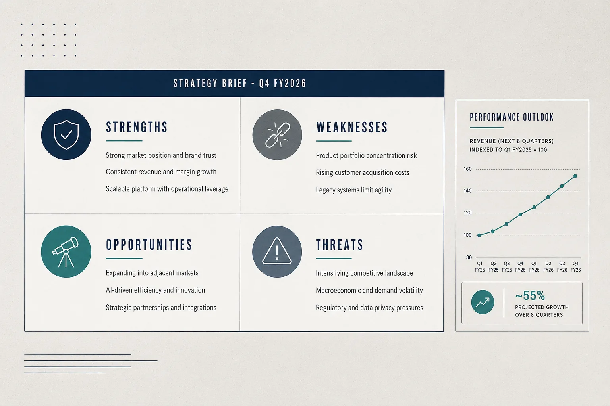</a>

| template | size | grader |
|---|---|---|
| <strong>business_data_dashboard</strong><br/>Light-theme analytics dashboard mockup with KPI tiles and two illustrative charts. | 1920x1088 | layout |
| <strong>business_linkedin_carousel</strong><br/>LinkedIn "by the numbers" carousel cover slide with bold dark-mode typography. | 1152x1440 | text_fidelity_dense |
| <strong>business_pitch_slide</strong><br/>Single-slide pitch deck cover with hero tagline and three headline metrics. | 1920x1088 | text_fidelity_dense |
| <strong>business_swot_card</strong><br/>Four-quadrant SWOT analysis card for executive briefings and quarterly reviews. | 1536x1024 | text_fidelity_dense |

<sub><a href="templates/business/"><strong>View 4 templates →</strong></a></sub>

</td>
<td width="33%" valign="top">

<a id="domain-comic_book"></a>
### 💥 comic_book · 2 templates &nbsp; <a href="docs/assets/showcase-comic_book.webp">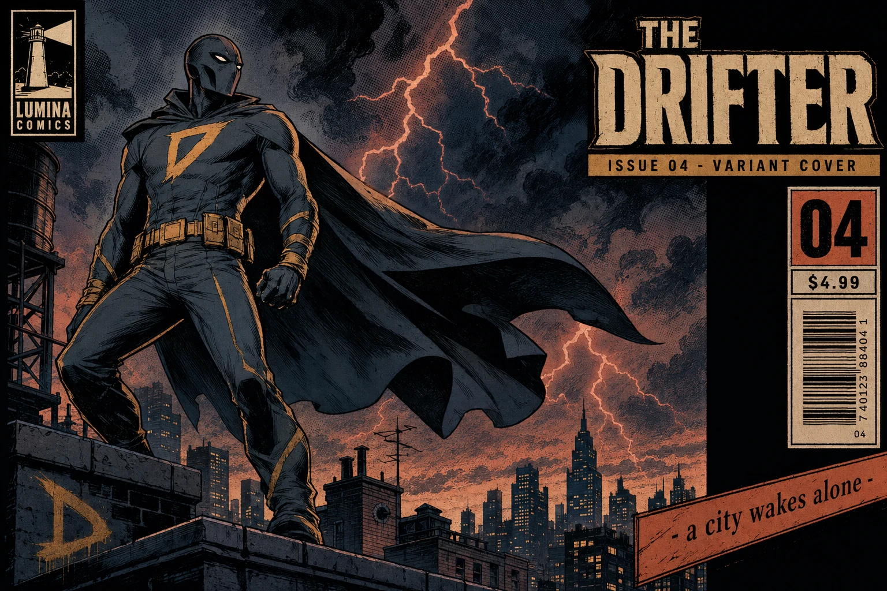</a>

| template | size | grader |
|---|---|---|
| <strong>comic_book_panel_page</strong><br/>Multi-panel American comic-book interior page with speech balloons, halftone shading, and short panel captions. | 1024x1536 | continuity |
| <strong>comic_book_variant_cover</strong><br/>Single-figure American comic-book variant cover with masthead, issue number, and credit slug, in bold inks and halftone. | 1024x1536 | text_fidelity_dense |

<sub><a href="templates/comic_book/"><strong>View 2 templates →</strong></a> &nbsp;·&nbsp; <a href="templates/comic_book/DOMAIN_CARD.md">Domain card</a></sub>

</td>
<td width="33%" valign="top">

<a id="domain-ecommerce"></a>
### 🛍️ ecommerce · 3 templates &nbsp; <a href="docs/assets/showcase-ecommerce.webp">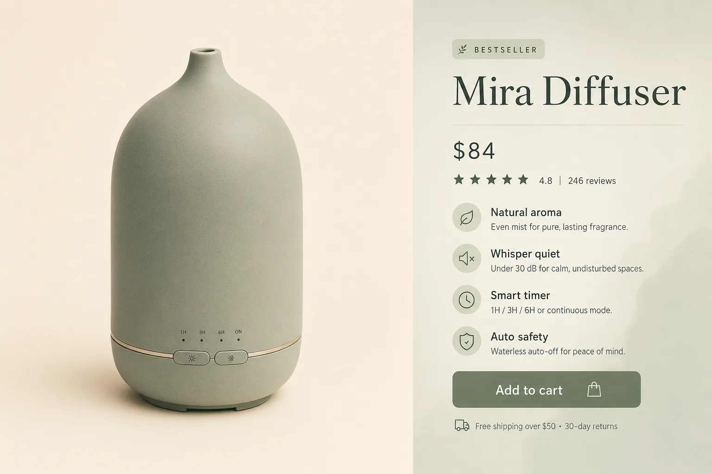</a>

| template | size | grader |
|---|---|---|
| <strong>ecommerce_category_banner</strong><br/>Wide 16:9 storefront category banner with a row of product silhouettes, headline, sub-text, and CTA. | 1920x1088 | text_fidelity_dense |
| <strong>ecommerce_marketplace_card</strong><br/>Compact 1:1 marketplace tile — product, price, and a single trust badge — built for grid views. | 1024x1024 | layout |
| <strong>ecommerce_product_hero</strong><br/>Single-SKU hero card for a product detail page — large product silhouette, price tag, primary CTA. | 1024x1280 | layout |

<sub><a href="templates/ecommerce/"><strong>View 3 templates →</strong></a> &nbsp;·&nbsp; <a href="templates/ecommerce/DOMAIN_CARD.md">Domain card</a></sub>

</td>
</tr>
<tr>
<td width="33%" valign="top">

<a id="domain-events"></a>
### 🎫 events · 2 templates &nbsp; <a href="docs/assets/showcase-events.webp">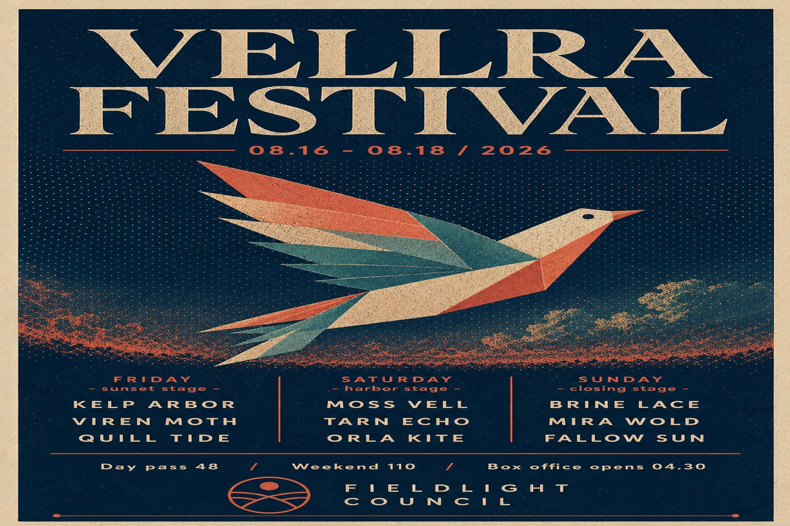</a>

| template | size | grader |
|---|---|---|
| <strong>events_concert_poster</strong><br/>Vertical concert / festival poster with headliner, support, date, and venue. | 1088x1920 | text_fidelity_dense |
| <strong>events_wedding_invite</strong><br/>Wedding invitation card — formal vertical layout with names, date, venue, and RSVP. | 1024x1280 | text_fidelity_dense |

<sub><a href="templates/events/"><strong>View 2 templates →</strong></a> &nbsp;·&nbsp; <a href="templates/events/DOMAIN_CARD.md">Domain card</a></sub>

</td>
<td width="33%" valign="top">

<a id="domain-fashion"></a>
### 👗 fashion · 3 templates &nbsp; <a href="docs/assets/showcase-fashion.webp">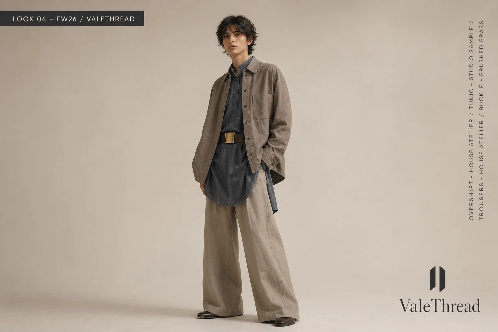</a>

| template | size | grader |
|---|---|---|
| <strong>fashion_flatlay_board</strong><br/>Styled flatlay of garments and accessories arranged on a surface for editorial use. | 1024x1024 | layout |
| <strong>fashion_lookbook_page</strong><br/>Editorial lookbook page — single-look hero shot with brand caption and item credits. | 1024x1280 | text_fidelity_dense |
| <strong>fashion_runway_poster</strong><br/>Vertical runway / show poster — brutalist editorial fashion-week announcement. | 1088x1920 | text_fidelity_dense |

<sub><a href="templates/fashion/"><strong>View 3 templates →</strong></a> &nbsp;·&nbsp; <a href="templates/fashion/DOMAIN_CARD.md">Domain card</a></sub>

</td>
<td width="33%" valign="top">

<a id="domain-food"></a>
### 🍽️ food · 3 templates &nbsp; <a href="docs/assets/showcase-food.webp">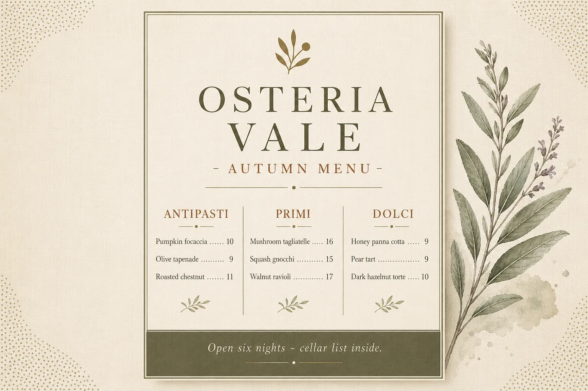</a>

| template | size | grader |
|---|---|---|
| <strong>food_menu_poster</strong><br/>Vertical restaurant menu wall poster — categorized dish list with prices and accent. | 1088x1920 | text_fidelity_dense |
| <strong>food_packaging_label</strong><br/>Packaged-goods label mock — branded coffee bag, bottle, or jar wrapper design. | 1152x1536 | text_fidelity_dense |
| <strong>food_recipe_card</strong><br/>Single-recipe card — image hero with recipe meta and key-ingredient callout. | 1024x1280 | text_fidelity_dense |

<sub><a href="templates/food/"><strong>View 3 templates →</strong></a> &nbsp;·&nbsp; <a href="templates/food/DOMAIN_CARD.md">Domain card</a></sub>

</td>
</tr>
<tr>
<td width="33%" valign="top">

<a id="domain-gaming"></a>
### 🎮 gaming · 3 templates &nbsp; <a href="docs/assets/showcase-gaming.webp">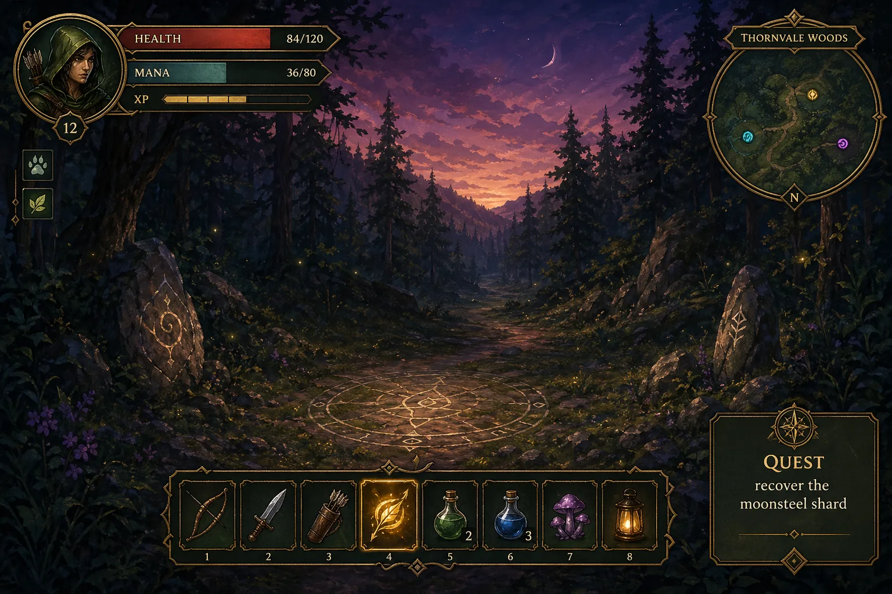</a>

| template | size | grader |
|---|---|---|
| <strong>gaming_hud_mockup</strong><br/>Fictional video-game HUD mockup with health and mana bars, minimap, mission objective overlay. | 1920x1088 | text_fidelity_dense |
| <strong>gaming_item_card</strong><br/>Vertical 3:4 collectible RPG/CCG-style item card with name, rarity ribbon, stat lines, and lore blurb. | 1152x1536 | text_fidelity_dense |
| <strong>gaming_map_panel</strong><br/>16:9 fantasy world-map / quest-map panel with three labeled regions and a parchment border. | 1920x1088 | layout |

<sub><a href="templates/gaming/"><strong>View 3 templates →</strong></a> &nbsp;·&nbsp; <a href="templates/gaming/DOMAIN_CARD.md">Domain card</a></sub>

</td>
<td width="33%" valign="top">

<a id="domain-industrial"></a>
### 🏭 industrial · 3 templates &nbsp; <a href="docs/assets/showcase-industrial.webp">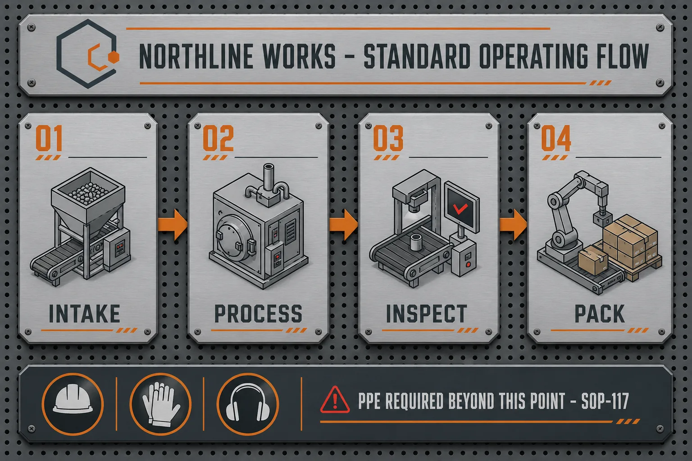</a>

| template | size | grader |
|---|---|---|
| <strong>industrial_cutaway_view</strong><br/>Isometric cutaway / exploded view of an industrial machine with four labeled internal components. | 1536x1024 | text_fidelity_dense |
| <strong>industrial_process_diagram</strong><br/>Wide 16:9 industrial process-flow diagram with four labeled stages and connecting arrows. | 1920x1088 | text_fidelity_dense |
| <strong>industrial_safety_poster</strong><br/>Vertical 9:16 factory-floor safety / hazard / PPE notice for posting at line entry points. | 1088x1920 | text_fidelity_dense |

<sub><a href="templates/industrial/"><strong>View 3 templates →</strong></a> &nbsp;·&nbsp; <a href="templates/industrial/DOMAIN_CARD.md">Domain card</a></sub>

</td>
<td width="33%" valign="top">

<a id="domain-infographic_data"></a>
### 📈 infographic_data · 2 templates &nbsp; <a href="docs/assets/showcase-infographic_data.webp">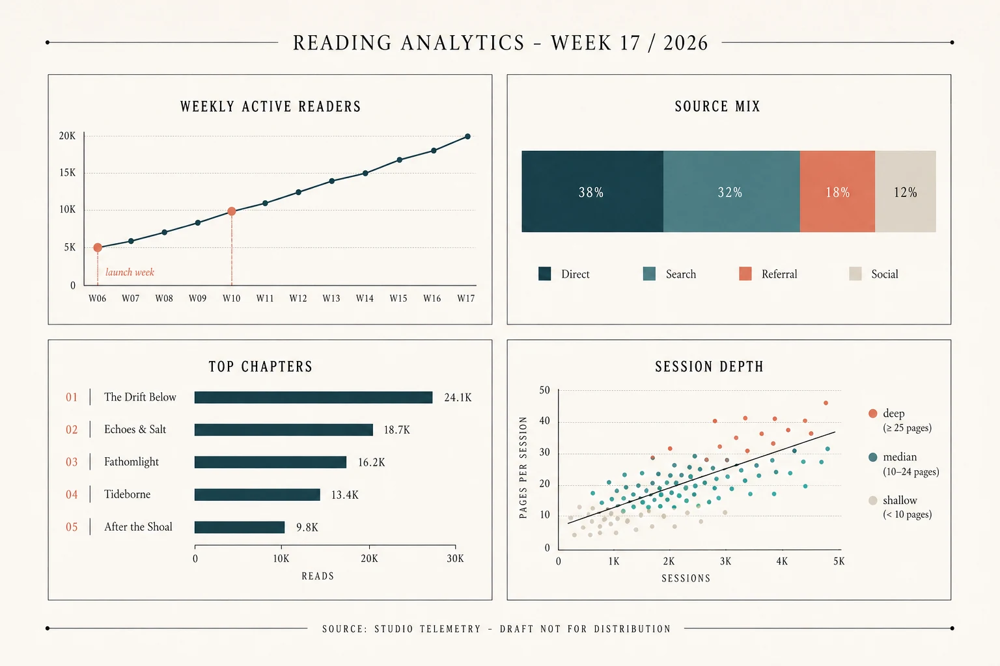</a>

| template | size | grader |
|---|---|---|
| <strong>infographic_data_chart_explainer</strong><br/>Single-chart explainer panel — large hero chart annotated with three pull-out callouts and a source line. | 1024x1280 | text_fidelity_dense |
| <strong>infographic_data_dashboard</strong><br/>Editorial dataviz dashboard explainer with four chart panels, headline, and insight callouts. | 1920x1088 | text_fidelity_dense |

<sub><a href="templates/infographic_data/"><strong>View 2 templates →</strong></a> &nbsp;·&nbsp; <a href="templates/infographic_data/DOMAIN_CARD.md">Domain card</a></sub>

</td>
</tr>
<tr>
<td width="33%" valign="top">

<a id="domain-interior"></a>
### 🛋️ interior · 3 templates &nbsp; <a href="docs/assets/showcase-interior.webp">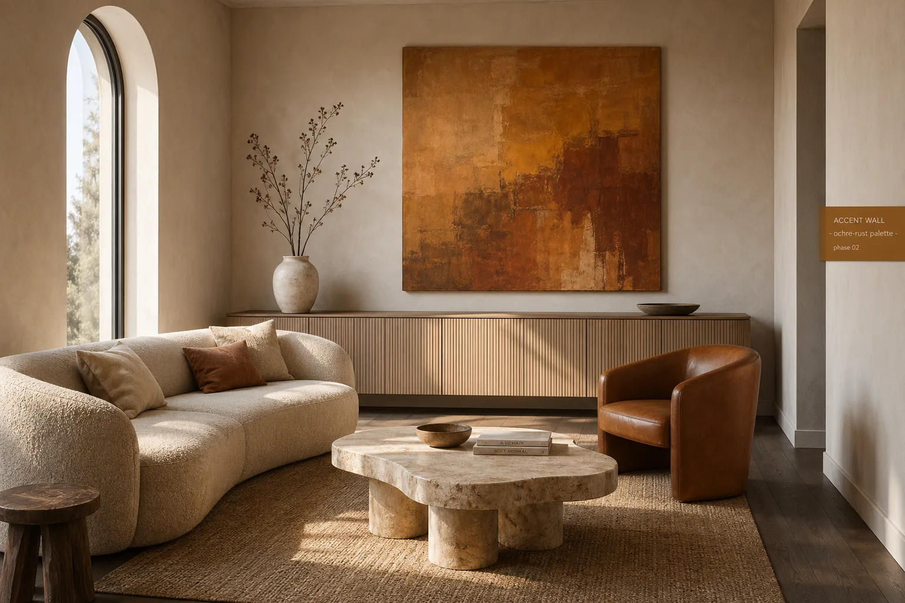</a>

| template | size | grader |
|---|---|---|
| <strong>interior_before_after</strong><br/>Split-screen interior before/after edit; left panel preserves the original, right panel shows the renovation. | 1920x1088 | edit_locality |
| <strong>interior_material_board</strong><br/>Square material / finish / color board (4-6 swatches with named labels) for an interior project. | 1024x1024 | layout |
| <strong>interior_room_mockup</strong><br/>Photoreal single-room interior mockup (bedroom / living / kitchen) with one labelled accent zone. | 1536x1024 | text_fidelity_sparse |

<sub><a href="templates/interior/"><strong>View 3 templates →</strong></a> &nbsp;·&nbsp; <a href="templates/interior/DOMAIN_CARD.md">Domain card</a></sub>

</td>
<td width="33%" valign="top">

<a id="domain-isometric_illustration"></a>
### 🧊 isometric_illustration · 2 templates &nbsp; <a href="docs/assets/showcase-isometric_illustration.webp">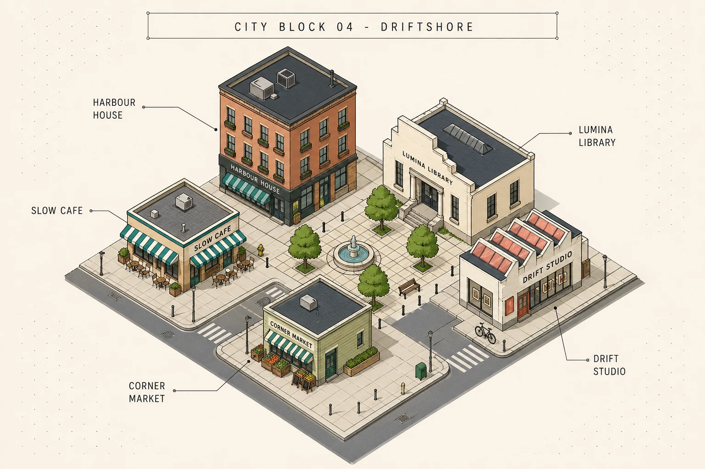</a>

| template | size | grader |
|---|---|---|
| <strong>isometric_city_block</strong><br/>True-isometric city block with named buildings, tiny vehicles, and street trees, projected on a strict 30-30 grid. | 1024x1024 | layout |
| <strong>isometric_workspace_scene</strong><br/>Isometric workspace scene — desk, studio, and side station — in true 30-30 projection with labeled accessories. | 1920x1088 | layout |

<sub><a href="templates/isometric_illustration/"><strong>View 2 templates →</strong></a> &nbsp;·&nbsp; <a href="templates/isometric_illustration/DOMAIN_CARD.md">Domain card</a></sub>

</td>
<td width="33%" valign="top">

<a id="domain-kids_illustration"></a>
### 🧸 kids_illustration · 2 templates &nbsp; <a href="docs/assets/showcase-kids_illustration.webp">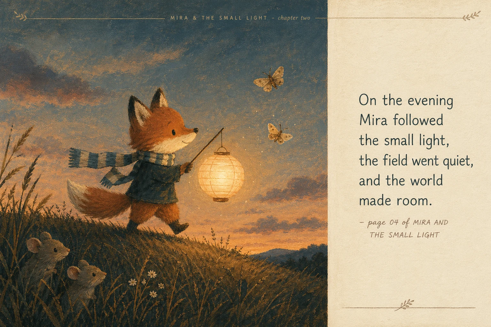</a>

| template | size | grader |
|---|---|---|
| <strong>kids_illustration_storybook_spread</strong><br/>Two-page children's storybook spread with friendly cast, narration band, and a single dialogue line. | 1920x1088 | text_fidelity_dense |
| <strong>kids_illustration_workbook_page</strong><br/>Preschool workbook page — counting / matching / coloring activity with friendly characters and a clear instruction line. | 1024x1280 | text_fidelity_dense |

<sub><a href="templates/kids_illustration/"><strong>View 2 templates →</strong></a> &nbsp;·&nbsp; <a href="templates/kids_illustration/DOMAIN_CARD.md">Domain card</a></sub>

</td>
</tr>
<tr>
<td width="33%" valign="top">

<a id="domain-music"></a>
### 🎵 music · 2 templates &nbsp; <a href="docs/assets/showcase-music.webp">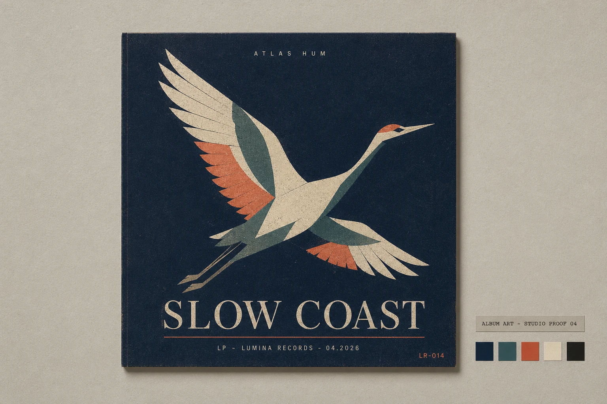</a>

| template | size | grader |
|---|---|---|
| <strong>music_album_cover</strong><br/>Square album-cover artwork — single hero visual identity with artist and album metadata. | 1024x1024 | text_fidelity_dense |
| <strong>music_concert_poster</strong><br/>Vertical tour / concert poster — headliner identity with tour name, dates, and city run. | 1088x1920 | text_fidelity_dense |

<sub><a href="templates/music/"><strong>View 2 templates →</strong></a> &nbsp;·&nbsp; <a href="templates/music/DOMAIN_CARD.md">Domain card</a></sub>

</td>
<td width="33%" valign="top">

<a id="domain-pet"></a>
### 🐾 pet · 2 templates &nbsp; <a href="docs/assets/showcase-pet.webp">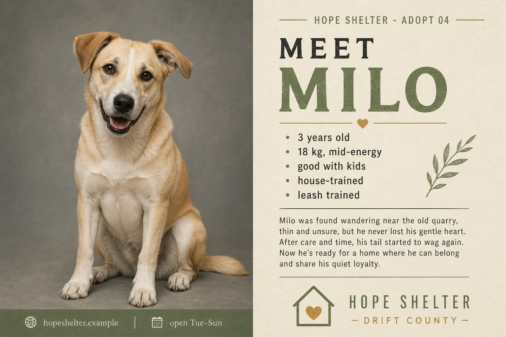</a>

| template | size | grader |
|---|---|---|
| <strong>pet_adoption_flyer</strong><br/>Single-animal adoption flyer — companion-animal photo with name, age, key trait, and shelter contact. | 1024x1280 | text_fidelity_dense |
| <strong>pet_food_packaging</strong><br/>Pet-food bag or can label — branded packaging plate with feeding metadata. | 1152x1536 | text_fidelity_dense |

<sub><a href="templates/pet/"><strong>View 2 templates →</strong></a> &nbsp;·&nbsp; <a href="templates/pet/DOMAIN_CARD.md">Domain card</a></sub>

</td>
<td width="33%" valign="top">

<a id="domain-photography"></a>
### 📷 photography · 3 templates &nbsp; <a href="docs/assets/showcase-photography.webp"></a>

| template | size | grader |
|---|---|---|
| <strong>photography_cinematic_still</strong><br/>Film-frame still — anamorphic cinematic look capturing a single narrative beat. | 1920x1088 | text_fidelity_sparse |
| <strong>photography_documentary_scene</strong><br/>Documentary photojournalism — natural, candid scene grounded in real-world observation. | 1536x1024 | text_fidelity_sparse |
| <strong>photography_editorial_portrait</strong><br/>Magazine-style editorial portrait — single subject, deliberate light and lens choice. | 1024x1280 | text_fidelity_sparse |

<sub><a href="templates/photography/"><strong>View 3 templates →</strong></a> &nbsp;·&nbsp; <a href="templates/photography/DOMAIN_CARD.md">Domain card</a></sub>

</td>
</tr>
<tr>
<td width="33%" valign="top">

<a id="domain-product"></a>
### 📦 product · 3 templates &nbsp; <a href="docs/assets/showcase-product.webp">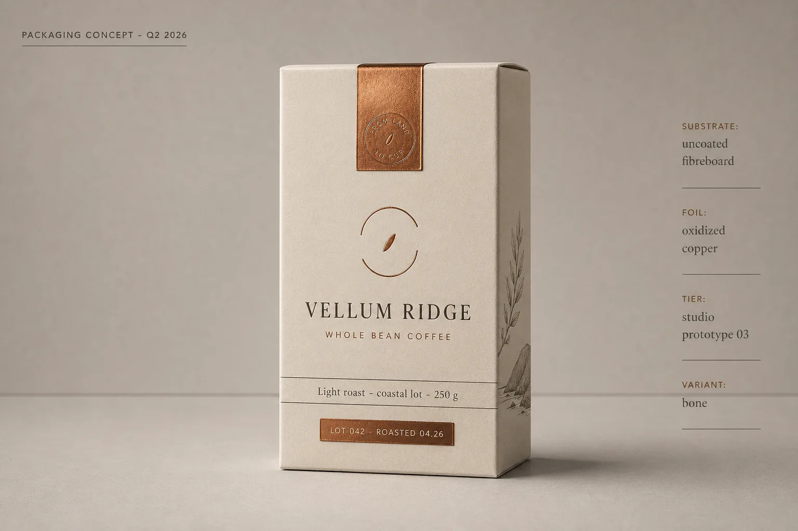</a>

| template | size | grader |
|---|---|---|
| <strong>product_comparison_board</strong><br/>Vertical 4:5 side-by-side comparison of three product variants with feature checkboxes by axis. | 1024x1280 | text_fidelity_dense |
| <strong>product_feature_callout</strong><br/>Hero shot of one product with three feature callouts arranged around it on a horizontal canvas. | 1920x1088 | layout |
| <strong>product_packaging_concept</strong><br/>Single-product packaging concept rendering — branded box / bottle / pouch on a minimal studio backdrop. | 1024x1024 | text_fidelity_dense |

<sub><a href="templates/product/"><strong>View 3 templates →</strong></a> &nbsp;·&nbsp; <a href="templates/product/DOMAIN_CARD.md">Domain card</a></sub>

</td>
<td width="33%" valign="top">

<a id="domain-science_fiction_concept"></a>
### 🚀 science_fiction_concept · 2 templates &nbsp; <a href="docs/assets/showcase-science_fiction_concept.webp">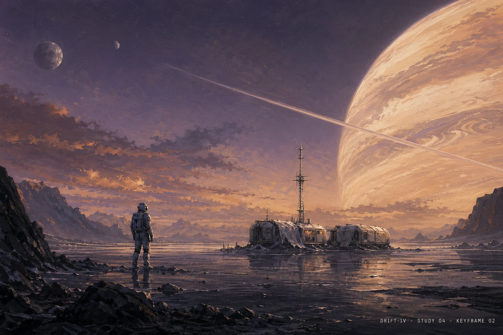</a>

| template | size | grader |
|---|---|---|
| <strong>science_fiction_concept_keyframe</strong><br/>Cinematic sci-fi keyframe matte painting — alien landscape or far-future urban scene with painterly atmosphere. | 1920x1088 | text_fidelity_sparse |
| <strong>science_fiction_concept_vehicle_hero</strong><br/>Hero side-view concept-art plate of a fictional sci-fi vehicle, mech, or spacecraft on a clean studio plate. | 1920x1088 | text_fidelity_sparse |

<sub><a href="templates/science_fiction_concept/"><strong>View 2 templates →</strong></a> &nbsp;·&nbsp; <a href="templates/science_fiction_concept/DOMAIN_CARD.md">Domain card</a></sub>

</td>
<td width="33%" valign="top">

<a id="domain-social_media"></a>
### 🗯️ social_media · 3 templates &nbsp; <a href="docs/assets/showcase-social_media.webp">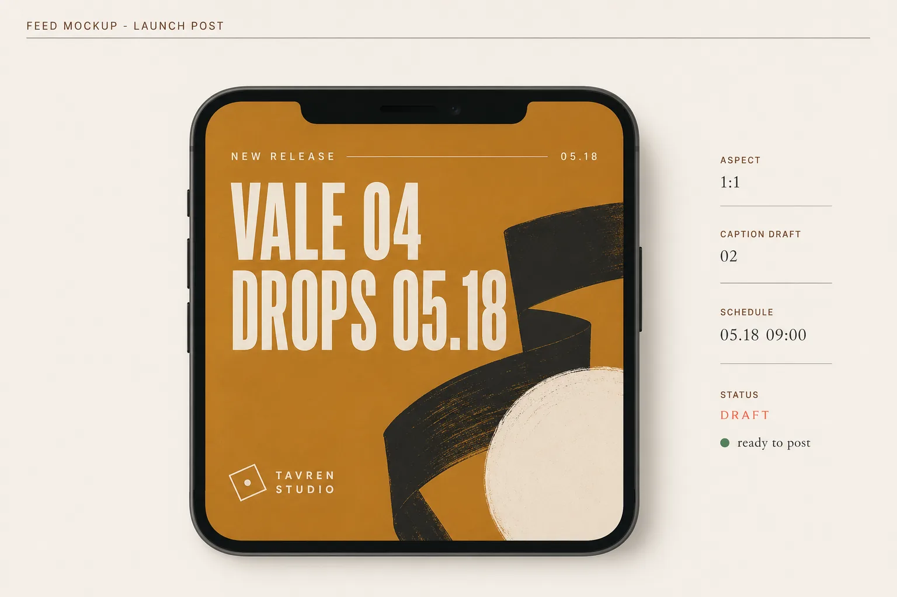</a>

| template | size | grader |
|---|---|---|
| <strong>social_media_launch_post</strong><br/>1:1 feed-friendly Instagram or X launch announcement post for a new product, with date and CTA. | 1024x1024 | text_fidelity_dense |
| <strong>social_media_story_sequence</strong><br/>9:16 vertical Instagram-Story-style 3-frame mini-narrative grid stitched into one image. | 1088x1920 | continuity |
| <strong>social_media_thumbnail_grid</strong><br/>1:1 YouTube-style 3-up thumbnail grid for previewing alternate channel-cover thumbnail concepts. | 1024x1024 | layout |

<sub><a href="templates/social_media/"><strong>View 3 templates →</strong></a> &nbsp;·&nbsp; <a href="templates/social_media/DOMAIN_CARD.md">Domain card</a></sub>

</td>
</tr>
<tr>
<td width="33%" valign="top">

<a id="domain-streetwear"></a>
### 👟 streetwear · 2 templates &nbsp; <a href="docs/assets/showcase-streetwear.webp">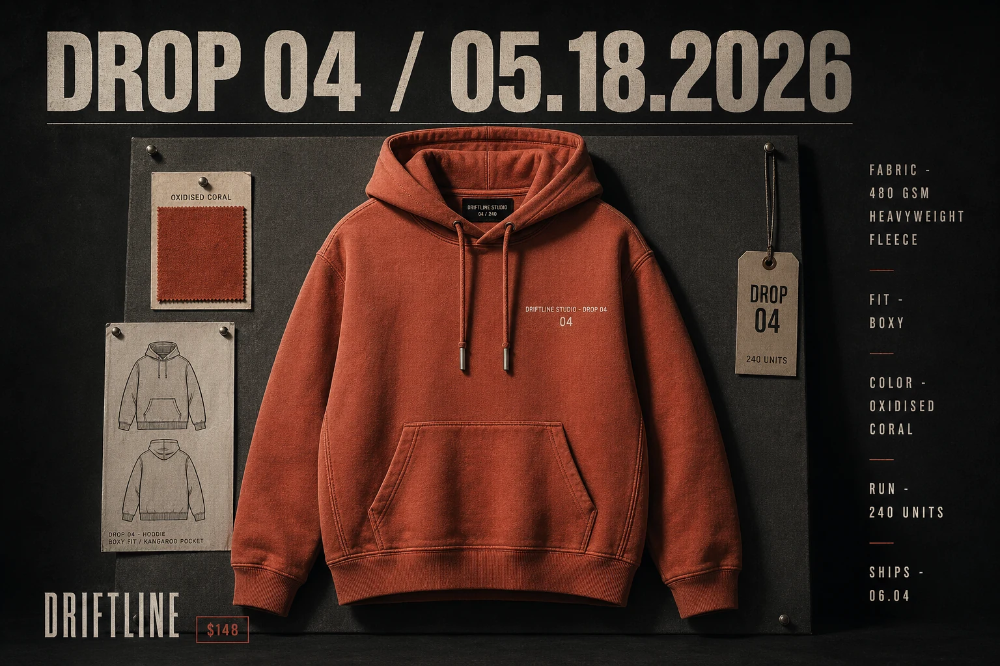</a>

| template | size | grader |
|---|---|---|
| <strong>streetwear_lookbook_drop</strong><br/>Drop-announcement lookbook plate — single street look with drop date and collection name. | 1024x1280 | text_fidelity_dense |
| <strong>streetwear_sneaker_hero</strong><br/>Single sneaker hero shot — stage-lit isolation plate for a fictional drop colorway. | 1024x1024 | text_fidelity_sparse |

<sub><a href="templates/streetwear/"><strong>View 2 templates →</strong></a> &nbsp;·&nbsp; <a href="templates/streetwear/DOMAIN_CARD.md">Domain card</a></sub>

</td>
<td width="33%" valign="top">

<a id="domain-tattoo"></a>
### 🪡 tattoo · 2 templates &nbsp; <a href="docs/assets/showcase-tattoo.webp">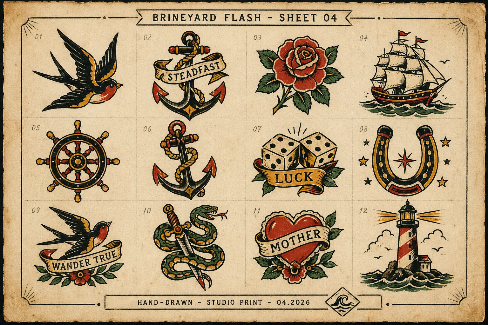</a>

| template | size | grader |
|---|---|---|
| <strong>tattoo_flash_sheet</strong><br/>Traditional tattoo flash sheet — multiple design vignettes on aged paper. | 1024x1280 | layout |
| <strong>tattoo_minimal_design</strong><br/>Single isolated minimalist tattoo design on stark white substrate. | 1024x1024 | text_fidelity_sparse |

<sub><a href="templates/tattoo/"><strong>View 2 templates →</strong></a> &nbsp;·&nbsp; <a href="templates/tattoo/DOMAIN_CARD.md">Domain card</a></sub>

</td>
<td width="33%" valign="top">

<a id="domain-travel"></a>
### ✈️ travel · 3 templates &nbsp; <a href="docs/assets/showcase-travel.webp">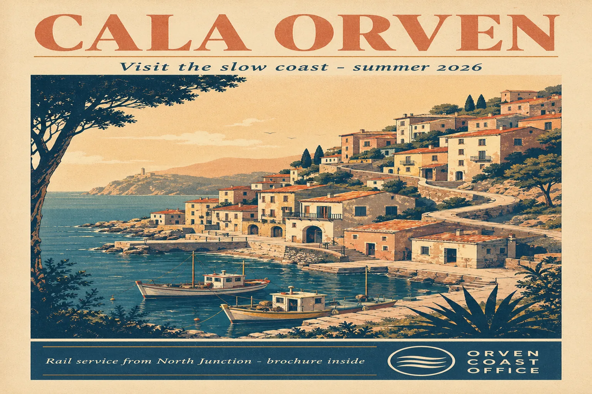</a>

| template | size | grader |
|---|---|---|
| <strong>travel_destination_poster</strong><br/>Vintage-style travel poster for a fictional or generic destination, with name, tagline, and year. | 1024x1536 | text_fidelity_dense |
| <strong>travel_itinerary_card</strong><br/>Single-page vertical itinerary card with day-by-day items for a short trip. | 1088x1920 | text_fidelity_dense |
| <strong>travel_map_guide</strong><br/>Illustrated tourist map with three numbered points of interest across a generic region. | 1920x1088 | layout |

<sub><a href="templates/travel/"><strong>View 3 templates →</strong></a> &nbsp;·&nbsp; <a href="templates/travel/DOMAIN_CARD.md">Domain card</a></sub>

</td>
</tr>
<tr>
<td width="33%" valign="top">

<a id="domain-typography"></a>
### 🔤 typography · 2 templates &nbsp; <a href="docs/assets/showcase-typography.webp">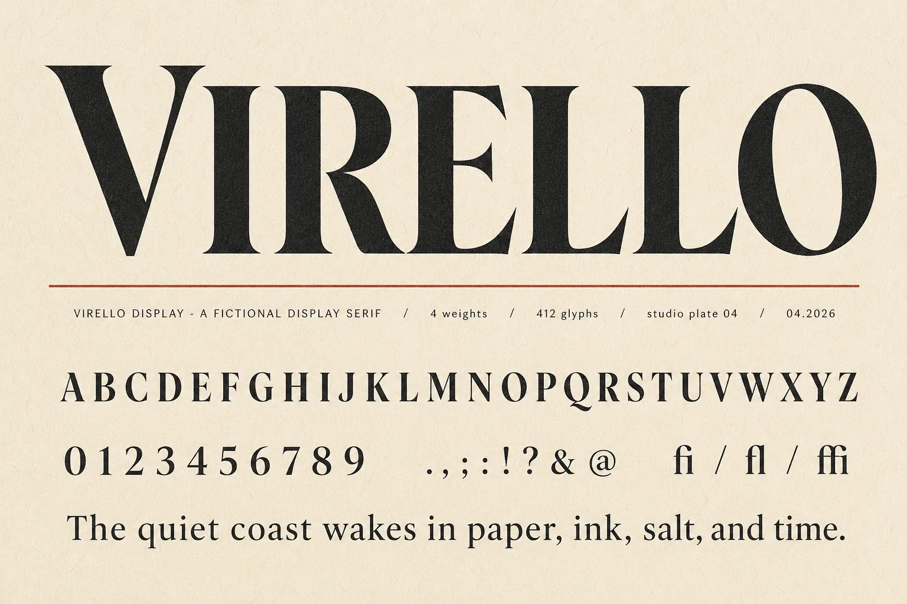</a>

| template | size | grader |
|---|---|---|
| <strong>typography_lettering_art</strong><br/>Hand-lettered art piece — a single phrase rendered as the visual subject. | 1024x1024 | text_fidelity_dense |
| <strong>typography_specimen_poster</strong><br/>Type specimen poster — display alphabet, glyph grid, and typeface metadata as the artwork. | 1024x1280 | text_fidelity_dense |

<sub><a href="templates/typography/"><strong>View 2 templates →</strong></a> &nbsp;·&nbsp; <a href="templates/typography/DOMAIN_CARD.md">Domain card</a></sub>

</td>
<td width="33%" valign="top">

<a id="domain-uiux"></a>
### 📱 uiux · 4 templates &nbsp; <a href="docs/assets/showcase-uiux.webp">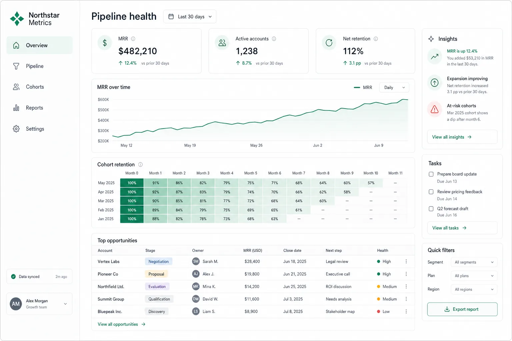</a>

| template | size | grader |
|---|---|---|
| <strong>uiux_design_system_card</strong><br/>Square design-system showcase card highlighting a single component or token with prop rows. | 1024x1024 | text_fidelity_dense |
| <strong>uiux_ios_app_mockup</strong><br/>Hyper-realistic iPhone app screenshot mockup with native iOS chrome and a card-based content feed. | 1088x1920 | text_fidelity_dense |
| <strong>uiux_social_cover_xhs</strong><br/>中文小红书风格教程封面 / Chinese-language Xiaohongshu cover for tutorial or lifestyle topic. | 1152x1536 | text_fidelity_dense |
| <strong>uiux_web_dashboard</strong><br/>Clean B2B SaaS analytics dashboard mockup with sidebar nav, KPI grid, and a primary chart. | 1920x1088 | text_fidelity_dense |

<sub><a href="templates/uiux/"><strong>View 4 templates →</strong></a></sub>

</td>
<td width="33%" valign="top">

<a id="domain-watercolor_illustration"></a>
### 🎨 watercolor_illustration · 2 templates &nbsp; <a href="docs/assets/showcase-watercolor_illustration.webp">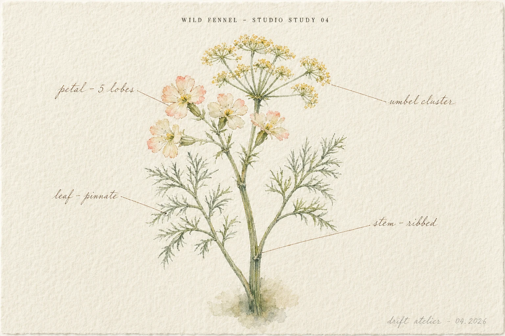</a>

| template | size | grader |
|---|---|---|
| <strong>watercolor_botanical_study</strong><br/>Single-specimen botanical watercolor study with latin caption, in transparent washes on visibly textured paper. | 1024x1280 | text_fidelity_sparse |
| <strong>watercolor_character_portrait</strong><br/>Three-quarter character portrait painted in transparent watercolor washes with visible paper grain and a small footer caption. | 1024x1280 | text_fidelity_sparse |

<sub><a href="templates/watercolor_illustration/"><strong>View 2 templates →</strong></a> &nbsp;·&nbsp; <a href="templates/watercolor_illustration/DOMAIN_CARD.md">Domain card</a></sub>

</td>
</tr>
</table>

<p align="center"><strong>Browse by category:</strong> <a href="#domain-academic">🎓 academic</a> · <a href="#domain-advertising">📢 advertising</a> · <a href="#domain-anime">🎌 anime</a> · <a href="#domain-architecture">🏛️ architecture</a> · <a href="#domain-automotive">🚗 automotive</a> · <a href="#domain-beauty">💄 beauty</a> · <a href="#domain-business">📊 business</a> · <a href="#domain-comic_book">💥 comic_book</a> · <a href="#domain-ecommerce">🛍️ ecommerce</a> · <a href="#domain-events">🎫 events</a> · <a href="#domain-fashion">👗 fashion</a> · <a href="#domain-food">🍽️ food</a> · <a href="#domain-gaming">🎮 gaming</a> · <a href="#domain-industrial">🏭 industrial</a> · <a href="#domain-infographic_data">📈 infographic_data</a> · <a href="#domain-interior">🛋️ interior</a> · <a href="#domain-isometric_illustration">🧊 isometric_illustration</a> · <a href="#domain-kids_illustration">🧸 kids_illustration</a> · <a href="#domain-music">🎵 music</a> · <a href="#domain-pet">🐾 pet</a> · <a href="#domain-photography">📷 photography</a> · <a href="#domain-product">📦 product</a> · <a href="#domain-science_fiction_concept">🚀 science_fiction_concept</a> · <a href="#domain-social_media">🗯️ social_media</a> · <a href="#domain-streetwear">👟 streetwear</a> · <a href="#domain-tattoo">🪡 tattoo</a> · <a href="#domain-travel">✈️ travel</a> · <a href="#domain-typography">🔤 typography</a> · <a href="#domain-uiux">📱 uiux</a> · <a href="#domain-watercolor_illustration">🎨 watercolor_illustration</a> · <a href="#table-of-contents">↑ TOC</a></p>

<details>
<summary><strong>Compose your own (CLI / Skill / web ChatGPT)</strong></summary>

```bash
# Compose a prompt locally and paste into web ChatGPT (no API key needed)
i2w template render <id> --lang en --vars <vars.yml> --out prompt.md
cat prompt.md  # ready to paste

# Render directly through the API (requires OPENAI_API_KEY)
i2w render generate --prompt-file prompt.md --size 1024x1024 --quality medium
```

</details>

<!-- END GALLERY -->

---

<a id="-showcase"></a>
## 🖼️ Showcase — 30 domains, 30 hero renders

<p align="center"><sub>One render per domain, generated via gpt-image-2 against the spec yaml in <a href="templates/"><code>templates/&lt;domain&gt;/</code></a>. Two large cards per row — every image is reading-size, no thumbnail-clicking required. Each card links into the full atlas page for that domain.</sub></p>

### 🏢 Enterprise · Brand · Data

<table width="100%" cellpadding="14" cellspacing="0">
<tr>
<td width="50%" valign="top" align="center">
<a href="docs/gallery/business.md"></a>
<br/><br/>
<strong>📊 business</strong> &middot; <sub>4 templates</sub>
<br/>
<sub>SWOT cards · pitch slides · LinkedIn carousels · data dashboards</sub>
</td>
<td width="50%" valign="top" align="center">
<a href="docs/gallery/academic.md"></a>
<br/><br/>
<strong>🎓 academic</strong> &middot; <sub>4 templates</sub>
<br/>
<sub>scientific diagrams · chalkboard proofs · multilingual posters · journal posters</sub>
</td>
</tr>
<tr>
<td width="50%" valign="top" align="center">
<a href="docs/gallery/uiux.md"></a>
<br/><br/>
<strong>📱 uiux</strong> &middot; <sub>4 templates</sub>
<br/>
<sub>iOS app mockups · web dashboards · design system cards · social covers</sub>
</td>
<td width="50%" valign="top" align="center">
<a href="docs/gallery/social_media.md"></a>
<br/><br/>
<strong>🗯️ social_media</strong> &middot; <sub>3 templates</sub>
<br/>
<sub>launch post · story sequence · thumbnail grid</sub>
</td>
</tr>
<tr>
<td width="50%" valign="top" align="center">
<a href="docs/gallery/infographic_data.md"></a>
<br/><br/>
<strong>📈 infographic_data</strong> &middot; <sub>2 templates</sub>
<br/>
<sub>editorial dashboards · chart explainers</sub>
</td>
<td width="50%" valign="top" align="center">
<a href="docs/gallery/ecommerce.md"></a>
<br/><br/>
<strong>🛍️ ecommerce</strong> &middot; <sub>3 templates</sub>
<br/>
<sub>product hero · marketplace card · category banner</sub>
</td>
</tr>
<tr>
<td width="50%" valign="top" align="center">
<a href="docs/gallery/product.md"></a>
<br/><br/>
<strong>📦 product</strong> &middot; <sub>3 templates</sub>
<br/>
<sub>packaging concept · feature callout · comparison board</sub>
</td>
<td width="50%" valign="top" align="center">
<a href="docs/gallery/advertising.md"></a>
<br/><br/>
<strong>📢 advertising</strong> &middot; <sub>3 templates</sub>
<br/>
<sub>campaign key visual · billboard mockup · 3-frame storyboard</sub>
</td>
</tr>
<tr>
<td width="50%" valign="top" align="center">
<a href="docs/gallery/streetwear.md"></a>
<br/><br/>
<strong>👟 streetwear</strong> &middot; <sub>2 templates</sub>
<br/>
<sub>lookbook drop · sneaker hero</sub>
</td>
<td width="50%" valign="top" align="center">
<a href="docs/gallery/automotive.md"></a>
<br/><br/>
<strong>🚗 automotive</strong> &middot; <sub>2 templates</sub>
<br/>
<sub>hero ad · dealership poster</sub>
</td>
</tr>
</table>

### 🎨 Creative · Story · Aesthetics

<table width="100%" cellpadding="14" cellspacing="0">
<tr>
<td width="50%" valign="top" align="center">
<a href="docs/gallery/anime.md"></a>
<br/><br/>
<strong>🎌 anime</strong> &middot; <sub>4 templates</sub>
<br/>
<sub>character sheets · 8-panel comics · city posters · CCD candid</sub>
</td>
<td width="50%" valign="top" align="center">
<a href="docs/gallery/comic_book.md"></a>
<br/><br/>
<strong>💥 comic_book</strong> &middot; <sub>2 templates</sub>
<br/>
<sub>variant cover · panel page</sub>
</td>
</tr>
<tr>
<td width="50%" valign="top" align="center">
<a href="docs/gallery/gaming.md"></a>
<br/><br/>
<strong>🎮 gaming</strong> &middot; <sub>3 templates</sub>
<br/>
<sub>HUD mockup · item card · map panel</sub>
</td>
<td width="50%" valign="top" align="center">
<a href="docs/gallery/science_fiction_concept.md"></a>
<br/><br/>
<strong>🚀 science_fiction_concept</strong> &middot; <sub>2 templates</sub>
<br/>
<sub>matte-painting keyframe · vehicle hero</sub>
</td>
</tr>
<tr>
<td width="50%" valign="top" align="center">
<a href="docs/gallery/kids_illustration.md"></a>
<br/><br/>
<strong>🧸 kids_illustration</strong> &middot; <sub>2 templates</sub>
<br/>
<sub>storybook spread · workbook page</sub>
</td>
<td width="50%" valign="top" align="center">
<a href="docs/gallery/fashion.md"></a>
<br/><br/>
<strong>👗 fashion</strong> &middot; <sub>3 templates</sub>
<br/>
<sub>lookbook page · flatlay board · runway poster</sub>
</td>
</tr>
<tr>
<td width="50%" valign="top" align="center">
<a href="docs/gallery/beauty.md"></a>
<br/><br/>
<strong>💄 beauty</strong> &middot; <sub>2 templates</sub>
<br/>
<sub>skincare packaging · editorial layout</sub>
</td>
<td width="50%" valign="top" align="center">
<a href="docs/gallery/photography.md"></a>
<br/><br/>
<strong>📷 photography</strong> &middot; <sub>3 templates</sub>
<br/>
<sub>editorial portrait · cinematic still · documentary scene</sub>
</td>
</tr>
<tr>
<td width="50%" valign="top" align="center">
<a href="docs/gallery/tattoo.md"></a>
<br/><br/>
<strong>🪡 tattoo</strong> &middot; <sub>2 templates</sub>
<br/>
<sub>flash sheet · minimal design</sub>
</td>
<td width="50%" valign="top" align="center">
<a href="docs/gallery/watercolor_illustration.md"></a>
<br/><br/>
<strong>🎨 watercolor_illustration</strong> &middot; <sub>2 templates</sub>
<br/>
<sub>botanical study · character portrait</sub>
</td>
</tr>
</table>

### 🏛️ Spatial · Systems · Moments

<table width="100%" cellpadding="14" cellspacing="0">
<tr>
<td width="50%" valign="top" align="center">
<a href="docs/gallery/architecture.md"></a>
<br/><br/>
<strong>🏛️ architecture</strong> &middot; <sub>3 templates</sub>
<br/>
<sub>facade concept · site diagram · presentation board</sub>
</td>
<td width="50%" valign="top" align="center">
<a href="docs/gallery/interior.md"></a>
<br/><br/>
<strong>🛋️ interior</strong> &middot; <sub>3 templates</sub>
<br/>
<sub>room mockup · material board · before / after</sub>
</td>
</tr>
<tr>
<td width="50%" valign="top" align="center">
<a href="docs/gallery/industrial.md"></a>
<br/><br/>
<strong>🏭 industrial</strong> &middot; <sub>3 templates</sub>
<br/>
<sub>process diagram · cutaway view · safety poster</sub>
</td>
<td width="50%" valign="top" align="center">
<a href="docs/gallery/isometric_illustration.md"></a>
<br/><br/>
<strong>🧊 isometric_illustration</strong> &middot; <sub>2 templates</sub>
<br/>
<sub>city block · workspace scene</sub>
</td>
</tr>
<tr>
<td width="50%" valign="top" align="center">
<a href="docs/gallery/typography.md"></a>
<br/><br/>
<strong>🔤 typography</strong> &middot; <sub>2 templates</sub>
<br/>
<sub>specimen poster · lettering art</sub>
</td>
<td width="50%" valign="top" align="center">
<a href="docs/gallery/events.md"></a>
<br/><br/>
<strong>🎫 events</strong> &middot; <sub>2 templates</sub>
<br/>
<sub>concert poster · wedding invite</sub>
</td>
</tr>
<tr>
<td width="50%" valign="top" align="center">
<a href="docs/gallery/music.md"></a>
<br/><br/>
<strong>🎵 music</strong> &middot; <sub>2 templates</sub>
<br/>
<sub>album cover · concert poster</sub>
</td>
<td width="50%" valign="top" align="center">
<a href="docs/gallery/food.md"></a>
<br/><br/>
<strong>🍽️ food</strong> &middot; <sub>3 templates</sub>
<br/>
<sub>menu poster · packaging label · recipe card</sub>
</td>
</tr>
<tr>
<td width="50%" valign="top" align="center">
<a href="docs/gallery/pet.md"></a>
<br/><br/>
<strong>🐾 pet</strong> &middot; <sub>2 templates</sub>
<br/>
<sub>adoption flyer · food packaging</sub>
</td>
<td width="50%" valign="top" align="center">
<a href="docs/gallery/travel.md"></a>
<br/><br/>
<strong>✈️ travel</strong> &middot; <sub>3 templates</sub>
<br/>
<sub>destination poster · itinerary card · map guide</sub>
</td>
</tr>
</table>

<p align="center"><sub>↑ <a href="#-featured">Back to Featured</a> &nbsp;·&nbsp; ↓ <a href="#atlas--30-domains-80-templates">Atlas detail</a> &nbsp;·&nbsp; <a href="#table-of-contents">↑ TOC</a></sub></p>

---

<a id="-capabilities"></a>
## 🛠️ Capabilities

<p align="center">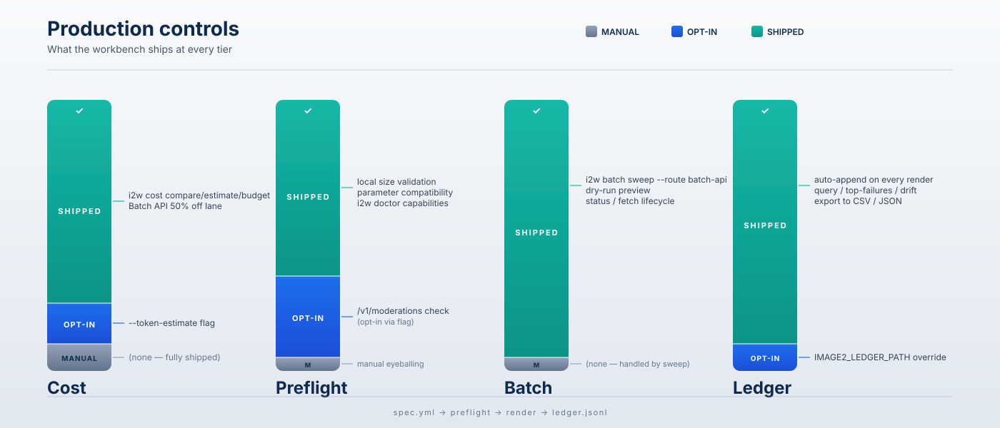</p>

| Feature | Status | CLI |
|---|---|---|
| Spec-first DSL (seven sections) |  | `i2w template render` |
| Bilingual EN + 中文 |  | `--lang en\|zh-CN` |
| Cost predictability |  | `i2w cost compare` |
| Pre-API validation |  | `i2w preflight` |
| Capability probe |  | `i2w doctor capabilities` |
| Batch API (50 % discount) |  | `i2w batch sweep --route batch-api` |
| Run ledger (JSONL) |  | `i2w ledger query` |
| Snapshot-drift report |  | `i2w ledger drift` |
| Skill bundle (7 runtimes) |  | see `skills/gpt-image/` |
| OCR-based eval |  | `i2w eval run` (prompt-only today) |
| Multi-model fallback |  | — |
| PyPI / wheel packaging |  | — |

---

<a id="-workflow"></a>
## 🔁 Workflow

<p align="center">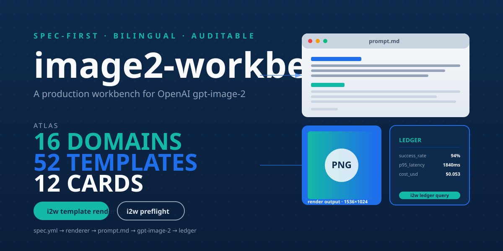</p>
<p align="center">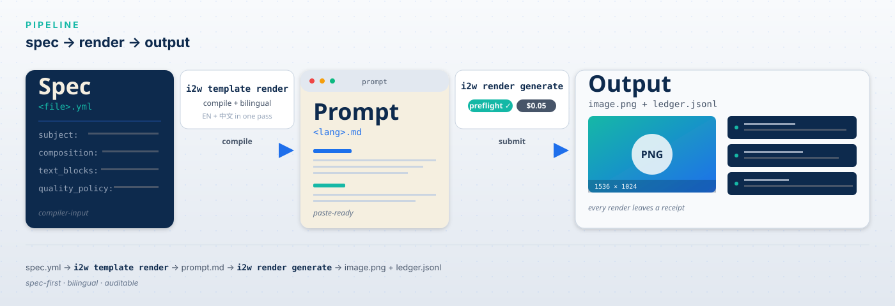</p>

<p align="center"><sub>One spec drives all three paths — paste-ready prompt for web ChatGPT, Images API render, or Batch API sweep — and every render writes one ledger row.</sub></p>

---

<a id="-cli-surface"></a>
## 💻 CLI surface

Eleven verbs, one entrypoint (`i2w`). Grouped by pillar so you can scan without grepping `--help`.

| Group | Command | Purpose |
|---|---|---|
| 🤖 Compose | `i2w catalog` | Browse and search the template / corpus catalog. |
| 🤖 Compose | `i2w template` | List templates and compile YAML specs into bilingual prompts. |
| 🤖 Compose | `i2w render` | Generate or edit images with local validation and sidecars. |
| 🤖 Compose | `i2w batch` | Build safe sweeps and Batch API jobs with dry-run previews. |
| 🤖 Compose | `i2w gallery` | Build paste-ready markdown galleries from templates. |
| 💰 Cost | `i2w cost` | Estimate, compare, and budget Images API spend. |
| 🛡️ Validate | `i2w preflight` | Reject known-bad requests locally, before any API call. |
| 🛡️ Validate | `i2w doctor` | Probe runtime parameter compatibility per account / org / model. |
| 📊 Inspect | `i2w ledger` | Query success rate, latency, cost, error distribution, snapshot drift. |
| 📊 Inspect | `i2w eval` | Run prompt-level rubric checks (OCR-eval coming in V0.4). |
| 📊 Inspect | `i2w version` | Print the installed workbench version. |

---

<a id="-skill-ecosystem"></a>
## 🤖 Skill ecosystem

`image2-workbench` ships a portable Skill bundle in [`skills/gpt-image/`](skills/gpt-image/). Drop it into any agent runtime that loads `SKILL.md`-style manifests.

| Runtime | Status | Manifest |
|---|---|---|
| Claude Code |  | [`manifests/claude.json`](skills/gpt-image/manifests/claude.json) |
| Anthropic Skills |  | [`manifests/claude.json`](skills/gpt-image/manifests/claude.json) |
| OpenAI Codex |  | [`manifests/codex.yml`](skills/gpt-image/manifests/codex.yml) |
| LangChain |  | [`manifests/langchain.py`](skills/gpt-image/manifests/langchain.py) |
| smolagents |  | [`manifests/smolagents.py`](skills/gpt-image/manifests/smolagents.py) |
| OpenClaw |  | [`manifests/openclaw.json`](skills/gpt-image/manifests/openclaw.json) |
| Hermes |  | [`manifests/hermes.yml`](skills/gpt-image/manifests/hermes.yml) |

<p><sub><a href="docs/skill-compatibility.md">Full skill compatibility matrix →</a></sub></p>

---

<a id="-faq"></a>
## ❓ FAQ

<details>
<summary><strong>🤔 How is this different from a curated prompt list?</strong></summary>

Prompt lists are markdown. This is a compiler. Templates are pydantic-validated YAML; outputs are auditable; the same template renders bilingual prompts <em>and</em> directly drives the API. See [`docs/positioning.md`](docs/positioning.md) for the long-form argument.

</details>

<details>
<summary><strong>🤔 Do I need an OpenAI API key?</strong></summary>

Not for the L3 path. `i2w template render` produces paste-ready markdown for web ChatGPT (no API key required). The L2 path (`i2w render generate`) needs `OPENAI_API_KEY` and a verified org. `doctor capabilities`, `cost`, `preflight`, `template`, `gallery`, and `catalog` all run offline.

</details>

<details>
<summary><strong>🤔 Why 30 domains and not "everything"?</strong></summary>

Each domain ships with a `DOMAIN_CARD.md` (FOR / NOT FOR / Key axes) so neighbouring domains stay distinct. We add a domain only when we can name 3 axes that no existing domain covers. Thirty cards live today, with 80 templates spread across the atlas.

</details>

<details>
<summary><strong>🤔 Will it work in 中文?</strong></summary>

Yes. All 80 templates render bilingual; demo vars include CJK content where it makes sense. The compiler is language-aware (CJK punctuation, line-breaks, glyph density), not a string find-and-replace. Read the Chinese guide at [`README.zh.md`](README.zh.md) and [`docs/getting-started.zh.md`](docs/getting-started.zh.md).

</details>

<details>
<summary><strong>🤔 What about safety and moderation?</strong></summary>

`i2w preflight` runs local validation (size, background, quality, unsupported params) and an optional Moderation API pass before billing. `MODERATION_BLOCKED` is its own exit code (5) so CI can branch on it. We do not default `moderation: low`; opt in explicitly when you need it.

</details>

<details>
<summary><strong>🤔 Why three pillars (cost / preflight / ledger)?</strong></summary>

A workbench has to answer three questions a prompt list can't: <em>"how much will this cost?"</em>, <em>"will this even work before I pay?"</em>, and <em>"what happened across my last 1,000 runs?"</em>. Each pillar maps to one CLI command surface, one exit-code class, and one section of the JSONL ledger.

</details>

<details>
<summary><strong>🤔 How is content licensed?</strong></summary>

Code is Apache-2.0. Templates, docs, README files, and the Skill `SKILL.md` are CC BY 4.0. Corpus records are per-source (see [`source_registry.yml`](corpus/manifests/source_registry.yml)). See the [licensing](#-licensing) section below.

</details>

---

<a id="-project-structure"></a>
## 🗂️ Project structure

```
image2-workbench/
├── src/image2_workbench/    # CLI + runtime + compiler + ledger + ...
├── templates/<domain>/       # 80 spec yaml + demo vars + DOMAIN_CARDs across 30 domains
├── skills/gpt-image/         # SKILL.md + 7 runtime manifests
├── docs/                     # gallery, positioning, cost-modeling, ...
├── corpus/                   # provenance-first prompt records
└── tests/                    # 1017+ unit + smoke tests
```

<p><sub><a href="AGENTS.md">Repository conventions (<code>AGENTS.md</code>) →</a></sub></p>

---

<a id="-licensing"></a>
## 📜 Licensing

| Path | License |
|---|---|
| `src/`, `tests/`, `scripts/`, `.github/` | Apache-2.0 ([LICENSE](./LICENSE)) |
| `templates/`, `docs/`, `README*`, `skills/gpt-image/SKILL.md` | CC BY 4.0 ([LICENSE-CONTENT](./LICENSE-CONTENT)) |
| `corpus/normalized/*.jsonl` | per-record (see [`source_registry.yml`](./corpus/manifests/source_registry.yml)) |

Attributions and methodology in [`NOTICE`](NOTICE).

---

<a id="-contributing"></a>
## 🙋 Contributing

Read [`AGENTS.md`](AGENTS.md) &mdash; file ownership, anti-patterns (no `transparent` background by default, no `input_fidelity`, no `moderation: low` defaults), V1 definition-of-done.

Security disclosures &rarr; [`SECURITY.md`](SECURITY.md).

---

<p align="center"><a href="./README.zh.md"><strong>中文版 README &rarr;</strong></a></p>
