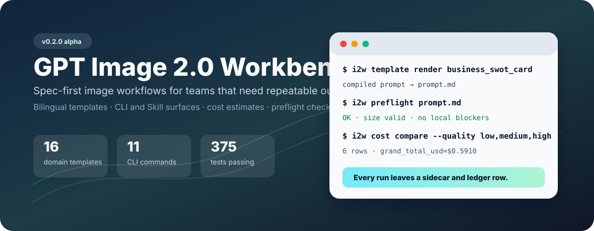
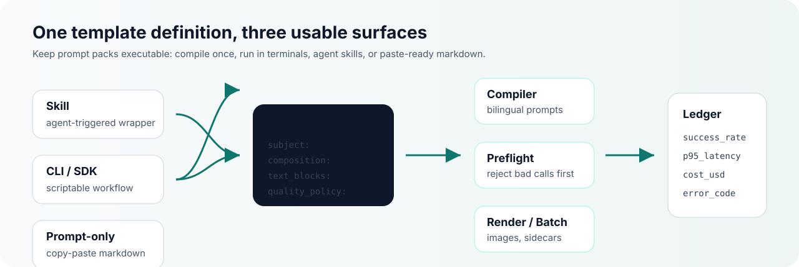

<!--
SPDX-License-Identifier: CC-BY-4.0
-->

# GPT Image 2.0 Workbench

Spec-first image generation workflows for people who need repeatable outputs,
not one-off prompt luck.

[中文](./README.zh.md)




---

## At a glance

| Item | Value |
|---|---|
| Core idea | Structured specs compile into runnable prompts, checks, renders, and ledger rows |
| Template set | 16 bilingual templates across business, academic, UI/UX, and anime domains |
| Surfaces | Skill bundle, Python CLI/SDK, and prompt-only markdown gallery |
| Production controls | Cost estimates, Batch API dry-run payloads, preflight validation, structured errors, run ledger |
| Release status | `v0.2.0` source-checkout alpha; PyPI/wheel packaging is planned for `v0.3` |

---

## What this repo is for

Use this repo when a prompt pack needs to become an executable workflow:

- **Write once as a spec.** Store subject, composition, exact text blocks,
  negative constraints, size, quality, and language targets in YAML.
- **Run before you spend.** Validate size/background/unsupported parameters,
  estimate cost, and generate Batch API JSONL payloads before calling the API.
- **Keep evidence.** Each render/edit/preflight/batch workflow can leave
  sidecars and ledger rows for later analysis.
- **Ship across surfaces.** The same template can become a CLI command, an
  agent Skill action, or a paste-ready prompt for web chat clients.



---

## Install

`v0.2.0` is a GitHub/source-checkout release. Install from the repository:

```bash
git clone https://github.com/StartripAI/gpt-image-2.0-workbench.git
cd gpt-image-2.0-workbench

python -m venv .venv
source .venv/bin/activate
pip install -e ".[dev]"
```

Set your API key when you want live rendering:

```bash
export OPENAI_API_KEY="sk-..."
```

Offline template, cost, gallery, and validation commands work without a live
API call.

---

## Quick usage

Render a bilingual template into one English prompt:

```bash
i2w template render business_swot_card \
  --lang en \
  --vars templates/business/_vars_examples/swot_acme.yml \
  --out out/swot.prompt.md
```

Validate before calling the image API:

```bash
i2w preflight out/swot.prompt.md --template-id business_swot_card --no-moderation-api
```

Compare cost choices:

```bash
i2w cost compare --size 1024x1024,1536x1024 --quality low,medium,high
```

Preview a batch payload without spending:

```bash
i2w batch sweep \
  --template business_swot_card \
  --vars templates/business/_vars_examples/swot_acme.yml \
  --route batch-api \
  --dry-run
```

Generate only when ready:

```bash
i2w render generate \
  --prompt-file out/swot.prompt.md \
  --template-id business_swot_card \
  --size 1536x1024 \
  --quality medium \
  --out out/swot.png
```


---

## Command surface

| Command | Purpose |
|---|---|
| `i2w catalog` | Search and list template/catalog metadata |
| `i2w template` | List templates and compile YAML specs into prompts |
| `i2w render` | Generate or edit images with local validation and sidecars |
| `i2w batch` | Build safe batch sweeps and Batch API jobs |
| `i2w eval` | Run prompt-level rubric checks |
| `i2w cost` | Estimate, compare, and budget image generation cost |
| `i2w doctor` | Inspect local/runtime capability assumptions |
| `i2w preflight` | Reject known-bad requests before API calls |
| `i2w ledger` | Query success rate, latency, cost, and error distribution |
| `i2w gallery` | Build paste-ready markdown galleries from templates |
| `i2w version` | Print the installed workbench version |

---

## Template gallery

| Domain | Templates | Gallery |
|---|---:|---|
| Business | 4 | [`docs/gallery/business.md`](./docs/gallery/business.md) |
| Academic | 4 | [`docs/gallery/academic.md`](./docs/gallery/academic.md) |
| UI/UX | 4 | [`docs/gallery/uiux.md`](./docs/gallery/uiux.md) |
| Anime | 4 | [`docs/gallery/anime.md`](./docs/gallery/anime.md) |

Each gallery page is generated from the same source templates used by the CLI.
That keeps the copy-paste prompt path aligned with executable workflows.

---

## Why it is useful

Prompt examples are good for discovery. A workbench is for repeatability.

`image2-workbench` focuses on the operational pieces that make image workflows
usable over time: spec versioning, compile-time validation, explicit costs,
safe batch previews, structured failure modes, and ledger-backed observability.

See:

- [`docs/getting-started.en.md`](./docs/getting-started.en.md)
- [`docs/form-factors.md`](./docs/form-factors.md)
- [`docs/error-codes.md`](./docs/error-codes.md)
- [`docs/cost-modeling.md`](./docs/cost-modeling.md)
- [`docs/positioning.md`](./docs/positioning.md)

---

## License

Code (`src/`, `tests/`, `scripts/`, `.github/`) is licensed under
**Apache-2.0**. Templates and documentation (`templates/`, `docs/`,
`README*`) are licensed under **CC BY 4.0**.

See [`LICENSE`](./LICENSE), [`LICENSE-CONTENT`](./LICENSE-CONTENT), and
[`LICENSE-CC-BY-4.0`](./LICENSE-CC-BY-4.0).
